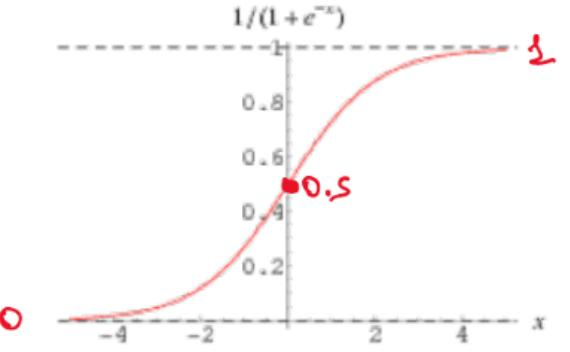
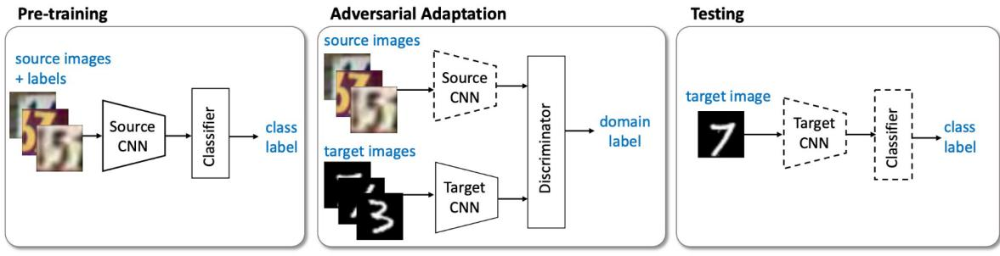

<style type="text/css">
body {
  counter-reset: h1;
  text-align: justify;
}
h1::before {
  counter-increment: h1;
  content: counter(h1) ". ";
}
h1 {
  counter-reset: h2;
}
h2::before {
  counter-increment: h2;
  content: counter(h1) "." counter(h2) ". ";
}
h2 {
  counter-reset: h3;
}
h3::before {
  counter-increment: h3;
  content: counter(h1) "." counter(h2) "." counter(h3) ". ";
}
h3 {
  counter-reset: h4;
}
h4::before {
  counter-increment: h4;
  content: counter(h1) "." counter(h2) "." counter(h3) "." counter(h4) ". ";
}
img {
    display: block;
    float: none;
    margin-left: auto;
    margin-right: auto;
    width: 80%;
}
</style>

# Concetti Base

<!---
## **Domande del capitolo:**

<span id="page-0-0"></span>Perché è importante normalizzare i dati?

#### **[Concetti Base](#page-0-0)**

[Introduzione](#page-0-1) [Tipologie](#page-1-0) di algoritmi di learning [Supervised learning](#page-1-1) [Unsupervised learning](#page-1-2) [Reinforcement](#page-1-3) learning [Self-supervised learning](#page-1-4) [Notazione](#page-1-5) [Normalizzazione](#page-2-0) Modelli generativi vs [discriminativi](#page-2-1) [Origine](#page-3-0) delle reti neurali
-->
## **Introduzione**

Il Machine Learning dona ai computer l'abilità di imparare senza essere esplicitamente programmati. La definizione formale è stata coniata da Tom Mitchel nel 1998:

> <span id="page-0-1"></span>Un algoritmo di machine learning si dice che impari da un **esperienza** T (E) rispetto ad un **task** H(T) ed una **misura di performance** P se le performance su H(T) misurate attraverso P migliorano con l'esperienza T(E).

Gli ingredienti principali di un algoritmo di Machine Learning sono:

- Model / Parametrized function / hypotesis $\mathit{\boldsymbol{H}}$
- Cost function $\mathit{\boldsymbol{J}}$
- Parameters $\mathit{\boldsymbol{\theta}}$
- Training algorithm / Learning procedure $\mathit{\boldsymbol{A}}$
- Training set $\mathit{\boldsymbol{X_{train}}}$
- Validation set $\mathit{\boldsymbol{X_{val}}}$
- Test set $\mathit{\boldsymbol{X_{test}}}$
- Evaluation measures $\mathit{\boldsymbol{P}}$

Dove tra i vari insiemi di dati sussiste la seguente relazione:

- $X = X_{train} \cup X_{val} \cup X_{test}$
- $X_i \cap X_j = \emptyset, i \neq$ e $i,j \in \{train,test,val\}$

## Tipologie di algoritmi di Learning

### <span id="page-1-1"></span><span id="page-1-0"></span>**Supervised learning**

Nel supervised learning si ha un dataset $X$ contenente dei dati  $x^{(i)} \in \mathbb{R}^d$  e i rispettivi ground truth  $y^{(i)} \in D$, per  $i = 1, ..., m$  e dove  $m$  è la dimensione del set di dati. Se  $D = \mathbb{R}$  allora si parla di regressione, se  $D = \{0,1,..., k\}$  allora si parla di classificazione. Si cerca di generalizzare un modello  $H$  che presa una  $x \in \mathbb{R}^d$  sappia fare inferenza sulla corrispondente $y \in D$. Gli approcci supervisionati sono generalmente più facili da gestire, ma richiedono la presenza di etichette. Ottenere etichette è spesso un problema costoso in termini di tempo, poiché richiede alle persone di annotare manualmente i dati.

### <span id="page-1-2"></span>**Unsupervised learning**

Si vuole trovare un modello  $H$  in grado di modellare dei dati  $x_i \in \mathbb{R}^d$   $i = 1,..., m$  in qualche modo. Il clustering ricade nei task di unsupervised learning.

### **Reinforcement learning**

Si tratta di policy learning, dove si allena un agente a comprendere le regole di un certo ambiente attraverso un sistema di rewards. Al tempo  $t$  l'agente effettua una azione  $a_t$, riceve una reward e aggiorna il suo stato a  $s_{t+1}$ .

### **Self-supervised learning**

Un ibrido tra supervised e unsupervised. Deriva dalla difficoltà di produrre labelled data (ad esempio nel campo medico). L'apprendimento avviene come negli infanti: in modo supervisionato, sfruttando la supervisione data dai dati

## **Notazione**

Si indicherà l'*i*-esimo input  $x^{(i)}$  come un vettore colonna a  $d$  dimensioni:

<span id="page-1-3"></span>
$$x^{(i)} \in \mathbb{R}^d \qquad x^{(i)} = [x_1^{(i)}, x_2^{(i)}, \dots, x_d^{(i)}]^T$$

Se l'input è una matrice di dimensione  $c \times r$  (es. un'immagine) allora:

<span id="page-1-5"></span><span id="page-1-4"></span>
$$x^{(i)} = \begin{bmatrix} x_{11}^{(i)} & \dots & x_{1r}^{(i)} \\ \vdots & \ddots & \vdots \\ x_{c1}^{(i)} & \dots & x_{cr}^{(i)} \end{bmatrix}$$

L'input in generale può essere un tensore a più dimensioni (es. video, imagine RGB).

I parametri del modello saranno indicati con  $\theta = [\theta_0, \theta_1,..., \theta_d]^T$ .

Con  $d$  si indicherà principalmente la dimensione dell'input, mentre con  $m$  la dimensione del training set. Con  $x_i^j$  indicheremo la componente  $j$-esima dell' $i$-esimo campione del training set. Per convenienza, estenderemo l'input impostando

<span id="page-2-0"></span>
$$x_0^{(i)} = 1$$

Nel caso in cui i dati siano vettori, possiamo rappresentare l'esperienza  $T$  come l'incolonnamento di tutti i campioni del training set, che formeranno una matrice di dimensione  $d \times m$ .

## **Normalizzazione**

La normalizzazione aiuta a velocizzare la fase di learning. Le componenti vengono rimappate nell'intervallo [0, 1].

La **normalizzazione min-max** della  $j$ -esima componente dei campioni nel dataset avviene nel seguente modo:

$$
\hat{x}_j = \frac{x_j - x_j^{min}}{x_j^{max} - x_j^{min}}
$$

Ma la normalizzazione più utilizzata è la **zero mean normalization**, dove  $\mu_j$  e  $\sigma_j$  sono rispettivamente la media e la deviazione standard della componente  $j$  tra i campioni nel dataset:

<span id="page-2-1"></span>
$$
\hat{x}_j = \frac{x_j - \mu_j}{\sigma_j}
$$

Possiamo calcolare media e deviazione standard come segue:

$$\mu_j = \frac{1}{m} \sum_{i=1}^{m} x_j^{(i)} \qquad \qquad \sigma_j = \sqrt{\frac{1}{m} \sum_{i=1}^{m} \left[ x_j^{(i)} - \mu_j \right]^2}$$

Quello che succede è che i dati si centrano nello zero degli assi e la deviazione standard sarà pari ad 1 (z-scores).

È importante notare che i parametri per la normalizzazione (min-max nel primo metodo, media e std nel secondo) vengono calcolati nel training set e utilizzati nel test set e nel validation set (ed in produzione).

## **Modelli generativi vs discriminativi**

- Nei **modelli generativi** si cerca di modellare esplicitamente la distribuzione dei dati, imparando la distribuzione della probabilità congiunta  $P(x, y)$ . Essi fanno inferenza sulla probabilità condizionata utilizzando il teorema di Bayes.
- Nei **modelli discriminativi** si trova un decision boundary che separa i dati. Il modello impara direttamente a modellare la probabilità condizionata  $P(x \mid y)$ .


## **Origine delle reti neurali**

See [Chapter 10 of "Dive into Data Mining".](https://github.com/LemuelPuglisi/DiveIntoDataMining/blob/main/10_Reti_neurali.md) Di seguito la storyline:

- <span id="page-3-0"></span>1958, Rosenblat: *Perceptron*
- 1960, Widrow Hoff: *Adeline*
- 1969, Minksy Papert: *Perceptrons*
- 1970 1976, Linnainmaa / Werbros / Rumelhart Hinton Williams: *Backpropagation*
- 1997, Hochreiter Schmidhuber: *LSTM*
- 1998, Lecun Bottov Bengio Haffner: *CNN*
- 2006, Hinton Osindero Teh: *Deep Learning*
- 2009, Deng Fei-Fei: *ImageNet*
- 2013, Krizhevsky Sutskever Hinton: *AlexNet*
- 2015, MSRA: *ResNet*
- 2016, Deepmind: *AlphaGo*

## Semplice modello del cervello

La storia dell’apprendimento automatico inizia con i ricercatori che cercano di replicare il funzionamento del nostro cervello. Pertanto, i primi modelli di apprendimento automatico proposti si sono ispirati al funzionamento dell’unità computazionale di base del nostro cervello (il neurone).

Possiamo vedere un neurone come una semplice macchina di calcolo che riceve una serie di input, li elabora e restituisce un output. I componenti principali dei neuroni sono:

  1. Dendriti: consentono al neurone di ricevere più input.
  2. Soma: è l'unità di elaborazione del neurone.
  3. Assone: è il “canale di uscita” del neurone.

I neuroni possono comunicare con altri neuroni attraverso segnali elettrici che vengono ricevuti attraverso i dendriti e trasmessi attraverso l'assone. Questi segnali tendono ad avere solo due livelli: “alto” e “basso”. Quando un neurone emette un livello di corrente elevato, allora lo diciamo il neurone “spara” oppure è attivo, mentre il neurone è inattivo quando emette un basso livello di corrente. Quindi, possiamo pensare a un neurone come a una macchina di calcolo binario: prende un insieme di input binari e restituisce un valore binario (0 o 1).

Se i neuroni sono macchine così semplici, come può funzionare il nostro cervello? Molti neuroni collegati tra loro formano una “rete”. Questa rete è collegata ai nostri organi sensoriali (ad esempio occhi, orecchie, ecc.) per raccogliere segnali di input. A seconda dei segnali osservati, alcuni neuroni si “accenderanno”, mentre altri rimarranno inattivi.
Gruppi di neuroni si specializzano per “attivarsi insieme” quando viene mostrato un dato input. Ad esempio, un insieme di neuroni si attiverà quando viene mostrato un segmento orizzontale davanti all'occhio, mentre altri saranno sensibili alle linee verticali.
I neuroni tendono a essere distribuiti in strati, con i neuroni all'interno di uno strato che comunicano principalmente con i neuroni negli strati superiore e inferiore. Inoltre, le connessioni vanno principalmente dai sensi ai neuroni superiori nella gerarchia (sebbene esistano le cosiddette “connessioni a ritroso”).

I neuroni più in alto nella gerarchia tendono ad attivarsi in presenza di concetti più astratti, come volti umani e categorie di oggetti. Ciò sembra suggerire che le rappresentazioni nella nostra testa siano gerarchiche e che i concetti di alto livello (ad esempio, i volti umani) siano rappresentati come una composizione di concetti di livello inferiore (ad esempio, bordi o parti di volti umani come nasi e bocche).

## Neuroni di McCulloch-Pitts

Il primo tentativo di modellare matematicamente un neurone è dovuto a McCulloch (un neuroscienziato) e Walter Pitts (un logico) che proposero il neurone McCulloch-Pitts nel 1943. Un McCulloch-Pitts può essere visto come un'unità che riceve n input binari e restituisce un output:


Analogamente al modello di un neurone, tutti gli input e gli output sono binari. Il neurone è anche associato ad una soglia $\theta$.
L’output può “distribuirsi” molte volte, collegandosi ad altri neuroni. Gli input 𝑥𝑖 possono provenire da altri neuroni o essere caratteristiche di un elemento di input. Ogni input è collegato al neurone tramite archi diretti (tutti vanno dall'input al neurone). Esistono due tipi di connessioni: **eccitatoria** e **inibitoria**. Per indicare gli input inibitori si mette un pallino come nelle porte logiche negate. Il neurone esegue un semplice calcolo:

  1. Supponiamo che il neurone ottenga $x_1,...,x_n$ input eccitatori e $y_1,...,y_m$ input inibitori.
  2. Se $m \ge 1$ e almeno uno degli input inibitori è $1$, il neurone viene inibito e il calcolo finale è $0$ (il neurone non si attiva).
  3. Altrimenti l'eccitazione totale viene calcolata sommando i valori degli ingressi eccitatori: $x = x_1 + x_2 + ... + x_n$. Se $x \ge \theta$ l'uscita è $1$ (l'unità si accende), altrimenti no.

L'operazione di soglia (thresholding) può essere vista come una funzione a gradino che trasforma un ingresso non binario in un'uscita binaria.


Sebbene questo modello possa sembrare semplice, la scelta della soglia appropriata permette di implementare semplicemente porte AND e OR anche con più di due input:


L'utilizzo di connessioni inibitorie (contrassegnate da un punto all'estremità del bordo) può consentire di implementare unità logiche ancora più complesse:


Quindi, abbiamo un modello parametrico con cui può implementare diverse funzioni con una scelta adeguata dei parametri. I parametri qui sono:
  
  1. La natura di ciascuna connessione (eccitatoria o inibitoria).
  1. Il valore della soglia $\theta$.

McCulloch e Pitts dimostrarono anche che impilare diverse unità potrebbe consentire di implementare funzioni più complesse, creando così i primi tipi di “reti neurali artificiali”.


## Limitazioni

Il neurone McCulloch-Pitts ha diverse limitazioni:

  1. È progettato per gestire solo input binari ed eseguire operazioni logiche. Pertanto, non è adatto per essere utilizzato con caratteristiche arbitrarie (ad esempio, numeri reali o interi).
  1. I parametri sono fissi e devono essere selezionati manualmente. Ciò significa che possiamo adattare il modello per risolvere problemi diversi, ma per farlo dovremmo sapere qual è la soluzione logica del problema. Idealmente, vorremmo essere in grado di trovare automaticamente (con una procedura di apprendimento) la scelta appropriata per i parametri esaminando una serie di esempi.
  1. Tutti gli input sono uguali? Non possiamo assegnare importanza ai diversi input.
  1. Tutte le funzioni calcolate sono linearmente separabili.

# **Perceptron**

<!--## **Domande del capitolo.**

<span id="page-4-0"></span>L'algoritmo di training converge?

```
Perceptron
    Introduzione
    Perceptron training
    Evaluation during training
    ADELINE variation in training
    XOR Problem 
        Linear Separability
        Non Linear Separability
        Solving the XOR problem
    Resources
```-->
## **Introduzione al perceptron**

Il perceptron fu ideato da Rosemblatt originariamente come una macchina per la classificazione binaria, quindi  $x \in \mathbb{R}^d \rightarrow y \in \{0, 1\}$ ma può essere esteso a valori reali. Esso supera alcune limitazioni in due modi:

- Assegnazione dei pesi alle connessioni. Questi pesi verranno moltiplicati per i valori di input. Poiché sono possibili pesi negativi, non è necessario distinguere tra connessioni eccitatorie e inibitorie.
- Fornire un algoritmo di apprendimento efficace per il percettrone in grado di trovare i pesi appropriati del modello (i pesi sono parametri del modello) se esistono.

Il suo funzionamento è il seguente:
<span id="page-4-1"></span>

1. Si ha un peso  $\theta_i$  per ogni componente dell'input:
2. Effettuare una combinazione lineare tra il vettore dei pesi e quello dell'input
3. Se il risultato della combinazione è maggiore di una soglia  $t$, ritorna 1, altrimenti 0


La  $\hat{y}$  nell'immagine corrisponde ad una stima del ground truth  $y$, ed è ottenuta come segue:

$$\hat{y} = \begin{cases} 1 & \sum_{j=1}^{d} x_j \theta_j > t \\ 0 & \text{altrimenti} \end{cases}$$

La threshold  $t$  resta un iperparametro del modello. Per ottenere anche  $t$  dal learning basta inserire una componente fittizia  $x_0 = 1$  ed imparare il peso  $\theta_0$ .


## **Perceptron training**

La principale innovazione di Rosenblatt è stata quella di fornire una procedura di addestramento per il percettrone. L'approccio proposto segue un processo iterativo in cui i parametri del modello vengono prima inizializzati in modo casuale, quindi adattati per ridurre il numero di errori commessi sui dati di addestramento. Il processo viene ripetuto in modo iterativo finché non vengono più commessi errori.
L'algoritmo di training originale del Perceptron è il seguente:

1. Inizializzare randomicamente pesi e soglia: $t$
2. Utilizzare i campioni $x^{(i)}$ e calcolare $\hat{y}^{(i)} = f(x_i)$ con $f(x_i)$ che è il percettrone
3. Ad ogni predizione sbagliata vengono aggiornati i pesi come segue:
    1. (**caso a**) Se $\hat{y}^{(i)} = 0$ e $y^{(i)} = 1$ allora aumenta il valore dei pesi
    2. (**caso b**) Se $\hat{y}^{(i)} = 1$ e $y^{(i)} = 0$ allora abbassa il valore dei pesi
4. Ripeti dal passo 2 finché non si soddisfa un criterio di terminazione

Possiamo scrivere matematicamente il passo di aggiornamento dei pesi come segue:

<span id="page-5-0"></span>
$$
\theta_j^{new} = \theta_j^{old} + \eta(y^{(i)} - \hat{y}^{(i)}) \cdot x_j^{(i)}
$$

Assumendo che $x_j^{(i)}$ sia normalizzato in $[0, 1]$, possiamo considerarlo come una sorta di lunghezza del passo di aggiornamento. L'espressione $(y^{(i)} - \hat{y}^{(i)})$ risulta $0$ quando la predizione è corretta, quindi groundtruth e inferenza sono uguali ed in tal caso il peso resta invariato; risulta $1$ nel caso (a) e $-1$ nel caso (b), quindi nel caso (a) andiamo a sommare $x_j^{(i)}$ al vecchio peso e lo "incrementiamo", mentre nel caso (*b*) andiamo a sottrarre $x_j^{(i)}$ quindi lo "decrementiamo". $\eta$ è il **learning rate** e indica quanto grande deve essere l'aggiornamento. Questo algoritmo arriva a soluzione se i punti in input sono linearmente separabili.

## **Evaluation during training**

Per valutare le performance del modello impostiamo una **loss function** / **cost function** che vogliamo minimizzare, essa corrisponde all'accuratezza:

<span id="page-5-1"></span>
$$ \text{cost function} = \frac{\#\text{errors }\hat{y}^{(i)} \neq y^{(i)}}{|X_{train}|} $$

### **ADELINE variation in training**

ADELINE è una variante del classico Perceptron. Durante il training, mentre il Perceptron aggiorna i pesi basandosi sull'output della funzione DOPO la sogliatura, quindi confrontando due valori binari, ADELINE aggiorna i pesi sfruttando il valore della combinazione lineare, quindi prima della sogliatura.

<span id="page-6-1"></span><span id="page-6-0"></span>
$$
\theta_j^{new} = \theta_j^{old} + \eta\left( y^{(i)} - \sum_{j=1}^d x_j^{(i)} \theta_j \right) \cdot x_j^{(i)}.
$$

## **XOR Problem**

Ipotizziamo di utilizzare un singolo Perceptron, e prendiamo in considerazione le funzioni logiche a due variabili. Le funzioni logiche imparabili dal percettrone sono quelle i cui punti sono separabili attraverso una retta (siamo sul piano):


Le uniche due funzioni logiche non imparabili dal percettrone sono lo XOR e la funzione identità (1 se i bit in input sono uguali). Questo può essere dimostrato anche analiticamente: siano  $w_1, w_2$  i pesi del percettrone per i bit  $x_1, x_2$  rispettivamente. Se il percettrone riesce a convergere allo XOR, allora il seguente sistema di equazioni dovrebbe avere una soluzione:

$$
\begin{cases}
0 \oplus 0 = 0 \quad w_1 0 + w_2 0 = 0 & 0 < t \\
1 \oplus 0 = 1 \quad w_1 1 + w_2 0 = w_1 & w_1 \ge t \\
0 \oplus 1 = 1 \quad w_1 0 + w_2 1 = w_2 & w_2 \ge t \\
1 \oplus 1 = 0 \quad w_1 1 + w_2 1 = w_1 + w_2 & w_1 + w_2 < t
\end{cases}
$$

Da cui sovviene la contraddizione:  $t$  è una soglia strettamente positiva per la dis.1, e per le dis. 2 e 3 i valori  $w_1$  e  $w_2$  sono maggiori o uguali di  $t$ . La dis.4 assume che la somma  $w_1 + w_2$  siano minore stretta di  $t$, il che è assurdo per le prime 3 disequazioni. Quindi il sistema non ammette soluzioni. Da questa dimostrazione ci accorgiamo che il Perceptron può calcolare solo **decision boundaries lineari**!


Questo esempio suggerisce che i percettroni non possono risolvere tutti i tipi di problemi. Infatti, un percettrone è un classificatore lineare e può risolvere solo problemi in cui i dati di addestramento sono linearmente separabili.

> Nota: con  $d = 2, 14/16$  funzioni risultano linearmente separabili. All'aumentare di  $d$, il numero di funzioni logiche linearmente separabili diminuisce drasticamente (es.  $a$  contiene funzioni lin. sep.).

## **Linear Separability**

Due insiemi di punti  $A$  e  $B$  in uno spazio  $n$-dimensionale vengono detti linearmente separabili se esistono  $n + 1$  numeri reali  $w_1, w_1,..., w_{n+1}$  tali che ogni punto  $(x_1,..., x_n) \in A$  soddisfa la disequazione:

<span id="page-7-2"></span><span id="page-7-1"></span><span id="page-7-0"></span>
$$\forall (x_1, \ldots, x_n) \in A \Longrightarrow \sum_{i=1}^n x_i w_i \geq x_{n+1}$$

$$\forall (x_1, \ldots, x_n) \in B \Longrightarrow \sum_{i=1}^n x_i w_i < x_{n+1}$$

$x_{n+1}$ è $b$, di solito si dice che se la $sommatoria + b > 0$ allora $x \in A$ altrimenti $x \in B$

## **Non Linear Separability**

Un insieme di punti in un spazio si dice non-separabile linearmente se i punti con label  $y = 1$  non possono essere separati dai punti con label  $y = 0$  attraverso un iperpiano. In tal caso, il problema è non-perceptron computabile.

## **Solving the XOR problem**

Complicando il modello, lo XOR problem può essere risolto. Pensiamo ad esempio ad un modello con 2 iperpiani, in cui tutto ciò che sta tra i due iperpiani appartiene alla classe 1, mentre il resto appartiene alla classe 0. In generale, la soluzione ai problemi non linearmente separabili consiste nell'adozione di modelli più complessi.


I numeri $0,5$ nelle unità rappresentano le soglie. Analizziamolo e vediamo perché funziona. Il neurone superiore nel primo strato calcola questa funzione:

$$
f_1(x_1, x_2) = [x_1 − x_2 > 0,5]
$$

Il neurone inferiore nel primo strato calcola questa funzione:

$$
f_2(x_1, x_2) = [x_2 − x_1 > 0,5]
$$

Calcoliamo i risultati di queste funzioni per tutti i possibili input:

<center>

| x | y | $f_1$ | $f_2$ | x XOR y |
|:-:|:-:|:-----:|:-----:|:-------:|
| 0 | 0 |   0   |   0   |    0    |
| 0 | 1 |   0   |   1   |    1    |
| 1 | 0 |   1   |   0   |    1    |
| 1 | 1 |   0   |   0   |    0    |

</center>

Notiamo che ora i punti dati sono linearmente separabili! Ciò è stato possibile comprimendo gli input $(0,0)$ E $(1,1)$ della stessa classe “1”, ad un unico punto $(0,0)$. Se utilizziamo i pesi del percettrone finale, possiamo tracciare il confine della decisione:

$$f_2 = −f_1 +0,5$$


Quindi, il primo strato ha il ruolo di trasformare le caratteristiche in modo da rendere il problema più semplice e risolvibile dal successivo percettrone.
Anche se le reti XOR possono risolvere il problema XOR, l’algoritmo di apprendimento del percettrone descritto prima non può essere applicato direttamente a queste reti più complesse. Questa osservazione ha dato luogo al primo “inverno dell’intelligenza artificiale” (un periodo di ridotto interesse e finanziamenti per l’intelligenza artificiale). Dovremmo aspettare fino alla formalizzazione dell’algoritmo di backpropagation per porre fine all’inverno dell’IA.

## **Resources**

- <span id="page-7-3"></span>[Chapter 3 from "Neural Networks - A Systematic Introduction"](https://page.mi.fu-berlin.de/rojas/neural/chapter/K3.pdf)
- [StackExchange Difference between ADELINE and Perceptron](https://datascience.stackexchange.com/questions/36368/what-is-the-difference-between-perceptron-and-adaline)

# **Regressione**

<!--## **Domande del capitolo.**

 #### **[Regressione](#page-8-0)**

<span id="page-8-1"></span><span id="page-8-0"></span>[Introduzione](#page-8-1) [Regressione](#page-8-2) lineare univariata La [funzione](#page-9-0) costo -->

## **Introduzione**

Per regressione si intende la determinazione di una funzione  $y = h_\theta(x)$ che si adatta (fitting) ad un insieme di punti  $T = {\{(x^{(i)}, y^{(i)}), i = 1, ..., m, x^{(i)} \in \mathbb{R}^d, y^{(i)} \in \mathbb{R}\}}$. La funzione dipende da un insieme di parametri sconosciuto  $\theta = [\theta_1,...,\theta_n]^T$.

Il problema è di tipo supervised e l'inferenza viene fatta su valori continui. È definito come segue: dato un training set  $T$ ed alcune ipotesi su  $h_{\theta}(x)$, stimare dei parametri  $\theta$ per  $h_{\theta}$ usando  $T$. Una volta determinati i parametri, è possibile utilizzare  $h_{\theta}$ per stimare i valori  $y$ per nuove  $x$.

## Tipi di regressione

Sebbene la regressione possa essere definita in generale come il problema di mappare vettori in vettori con una funzione

$$f: \mathfrak{R}^n → \mathfrak{R}^m$$

alcuni casi speciali ottenuti considerando i valori di $n$ e $m$ sono particolarmente comuni nella pratica e per questo motivo hanno nomi speciali. Li riassumiamo di seguito:

### REGRESSIONE SEMPLICE

Quando $m = n = 1$, l'attività di regressione consiste nel mappare numeri scalari a numeri scalari con una funzione:
$$f: \mathfrak{R} → \mathfrak{R}$$
In questo caso, l'attività è definita **regressione semplice**.

> ***ESEMPIO***
Prevedere i prezzi delle case a partire dalla superficie in metri quadrati.

### REGRESSIONE MULTIPLA

Quando $m = 1$ e $n > 1$, l'attività di regressione consiste nel mappare vettori a numeri scalari con una funzione:
$$f: \mathfrak{R}^n → \mathfrak{R}$$
In questo caso, l'attività è definita **regressione multipla**.

> ***ESEMPIO***
Prevedere i prezzi delle case a partire dalla superficie in metri quadrati e dal numero di stanze. In questo caso, $n = 2$.

### REGRESSIONE MULTIVARIATA

Quando $m > 1$ e $n$ è arbitrario, l'attività di regressione consiste nel mappare vettori (o scalari se n = 1) a vettori con una funzione:
$$f: \mathfrak{R}^n → \mathfrak{R}^m$$
In questo caso, il compito è definito **regressione multivariata**.

> ***ESEMPIO***
Prevedere la posizione GPS da cui è stata acquisita un'immagine. In questo caso, $m = 2$.

## **Regressione lineare univariata**

Il classico esempio è quello della predizione dei prezzi delle case. Supponiamo che la variabile indichi l'area della casa in metri quadri e la variabile sia il rispettivo prezzo.


Sia  $m$ la dimensione del training set,  $(x, y)$ un generico campione e  $(x^{(i)}, y^{(i)})$ l'*i*-esimo campione. Il modello  $h_{\theta}$ prende anche il nome di ipotesi:

<span id="page-8-2"></span>
$$h_{\theta}(x) = \theta_0 + \theta_1 x$$

con $\theta_1$ coefficiente e $\theta_0$ intercetta.

Impostando diversi parametri  $\theta_1, \theta_2$ otteniamo diverse ipotesi:


## Regressione lineare multipla

Possiamo facilmente estendere il modello di regressione lineare semplice al caso della regressione multipla, ovvero al caso in cui
vogliamo trovare una funzione:

$$f: \mathfrak{R}^n → \mathfrak{R}$$

In questo caso, utilizzeremo un parametro per ciascuna delle dimensioni della variabile di input, più un parametro per l'intercetta:
$$f(x) = \theta_0 + \theta_1x_1 + ... + \theta_nx_n$$
I parametri del modello sono $\theta = (\theta_0, \theta_1x, ..., \theta_n)$. Imparare il regressore significa trovare valori appropriati dei
parametri $\theta$.

Per semplificare la notazione, possiamo porre $x_0 = 1$ e scrivere il modello lineare come segue:

$$f(x) = \sum_{i=0}^n\theta_ix_i$$

L'espressione precedente può anche essere scritta come:
$$f(x) = \theta^Tx$$
Si noti che questo modello è essenzialmente un perceptron senza alcuna operazione di sogliatura!

## Regressione lineare multivariata

Consideriamo ora il caso generale di regressione multivariata in cui vogliamo mappare i vettori sui vettori:

$$f: \mathfrak{R}^n → \mathfrak{R}^m$$

La regressione lineare multivariata risolve il problema definendo m regressori multipli indipendenti $f_i(x)$ che elaborano lo stesso input x, ma possono avere pesi diversi:

$$ \begin{pmatrix} y_1 \\ \vdots \\ y_m \end{pmatrix} = \begin{pmatrix} f_1(x) \\ \vdots \\ f_m(x) \end{pmatrix} $$

Ogni regressore $f_i(x)$ ha i propri parametri e le relative ottimizzazioni vengono eseguite in modo indipendente.

## **La funzione costo**

Possiamo scegliere i parametri tali che minimizzino la distanza tra l'ipotesi  $h_{\theta}$  ed i dati nel training set. Abbiamo bisogno quindi di una funzione costo, come l'MSE:

<span id="page-9-0"></span>
$$
J(\theta_0, \theta_1) = \frac{1}{2m} \sum_{i=1}^{m} \left[ h_{\theta} (x^{(i)})  - y^{(i)}\right]^2
$$

Se plottiamo questa funzione costo notiamo che essa ha un solo minimo globale. Abbiamo bisogno di una procedura che cerchi tale minimo in maniera automatica (prossimo capitolo).


# **Gradient Descent**

Il gradient descent è un algoritmo iterativo utilizzato per trovare il minimo di una funzione. Si basa sull'osservazione che, se una funzione $J(\theta)$ è definita e differenziabile in un intorno di un punto $\theta^{(0)}$, allora $J(\theta)$ diminuisce più rapidamente se si procede da $\theta^{(0)}$ verso la direzione della derivata negativa di $J$ calcolata in $\theta^{(0)}$. Il gradiente è una generalizzazione multivariabile della derivata. Il gradiente di una funzione di $n$ variabili calcolato in un punto $\theta$ è un vettore la cui variabile $i$-esima è data dalla derivata parziale della funzione rispetto alla variabile $i$-esima:

$$\nabla J(\theta) = \begin{pmatrix} J_{\theta_1}(\theta) \\ \vdots \\ J_{\theta_n}(\theta) \end{pmatrix} $$

Nel nostro caso, lo utilizziamo per minimizzare la funzione costo  $J$ . L'algoritmo funziona come segue:

1. Inizializza  $\theta = (\theta_0,..., \theta_n)$  randomicamente.
2. Aggiorna i pesi iterativamente fino a convergenza.

L'aggiornamento dei pesi avviene utilizzando come direzione di discesa la direzione inversa a quella del gradiente:

$$\theta_j := \theta_j - \alpha \frac{\partial}{\partial \theta_j} J(\theta) \qquad j = 0, \dots, n$$

Il parametro  $\alpha$  è detto learning rate, e determina la lunghezza del passo di aggiornamento. Se  $\alpha$  è troppo basso, l'algoritmo converge lentamente al minimo. Se  $\alpha$  è troppo alto, l'algoritmo può fallire nella convergenza o addirittura divergere. **Attenzione** ad aggiornare i pesi nell'ordine giusto!

<!-- ## Update

### Correct: Simultaneous update

$ \text{temp0} := \theta_0 - \alpha \frac{\partial}{\partial \theta_0} J(\theta_0, \theta_1) \\$
$\text{temp1} := \theta_1 - \alpha \frac{\partial}{\partial \theta_1} J(\theta_0, \theta_1) \\$
$\theta_0 := \text{temp0} \\$
$\theta_1 := \text{temp1} \\$

---

### Incorrect

$ \text{temp0} := \theta_0 - \alpha \frac{\partial}{\partial \theta_0} J(\theta_0, \theta_1) \\$
$ \theta_0 := \text{temp0} \\$
$ \text{temp1} := \theta_1 - \alpha \frac{\partial}{\partial \theta_1} J(\theta_0, \theta_1) \\$
$ \theta_1 := \text{temp1}$ -->
<center>

| Correct: Simultaneous update                                                                  | Incorrect                                                                                   |
|-----------------------------------------------------------------------------------------------|---------------------------------------------------------------------------------------------|
| $\text{temp0} := \theta_0 - \alpha \frac{\partial}{\partial \theta_0} J(\theta_0, \theta_1)$  | $\text{temp0} := \theta_0 - \alpha \frac{\partial}{\partial \theta_0} J(\theta_0, \theta_1)$|
| $\text{temp1} := \theta_1 - \alpha \frac{\partial}{\partial \theta_1} J(\theta_0, \theta_1)$  | $\theta_0 := \text{temp0}$                                                                  |
| $\theta_0 := \text{temp0}$                                                                    | $\text{temp1} := \theta_1 - \alpha \frac{\partial}{\partial \theta_1} J(\theta_0, \theta_1)$|
| $\theta_1 := \text{temp1}$                                                                    | $\theta_1 := \text{temp1}$                                                                  |

</center>

L'algoritmo può convergere ad un minimo locale se la funzione non è globalmente convessa. L'algoritmo di solito viene fermato dopo un certo numero di iterazioni o quando la variazione tra due iterazione è sotto un valore di soglia.

## **Feature scaling**

Al fine di accelerare la convergenza dell'algoritmo di discesa del gradiente, è utile scalare le features in modo che assumano valori in range simili, ovvero normalizzare le features. I parametri di normalizzazione (es. min e max per la normalizzazione min-max, media e std per la normalizzazione 0 mean) entrano a far parte del modello.

## **Gradient descent debugging**

Per capire se durante la discesa del gradiente il modello stia davvero "apprendendo" qualcosa, possiamo osservare l'andamento della funzione costo. Se la funzione costo ha un andamento decrescente al crescere del numero di iterazioni dell'algoritmo, allora l'aggiornamento dei nostri parametri ci sta portando verso il punto di minimo, ovvero stiamo "apprendendo", di conseguenza l'algoritmo sta lavorando correttamente. Per fare debugging dell'algoritmo bisogna guardare $J(\theta)$ durante il training. Ecco un paio di accorgimenti:

- Il numero di iterazioni necessario a raggiungere la convergenza varia da problema a problema.
- I pesi sono generati randomicamente la prima volta. Nel caso in cui in una run dell'algoritmo non si sia arrivati a convergenza, è possibile riutilizzare il pesi nella run successiva, piuttosto che ripartire da un punto random.

I casi in cui l'algoritmo non sta funzionando sono i seguenti:


Casi come questi indicano che il learning rate ha un valore troppo grande, sarebbe necessario ridurlo di almeno un ordine di grandezza. Non esiste un numero magico, solo attraverso la comprensione del grafico e la teoria è possibile allenare i modelli di machine learning.

Se il learning rate  $\alpha$  è sufficientemente piccolo, allora  $J(\theta)$  decrescerà ad ogni iterazione, ma se è troppo piccolo l'algoritmo andrà a convergenza molto lentamente.

## **Feature mapping**

Non è sempre possibile risolvere il problema di regressione usando modelli lineari come visto fino adesso. Se i punti nello spazio si dispongono approssimativamente lungo una linea, un piano, un iperpiano, allora il modello lineare riesce ad approssimare bene, quindi avremo un errore  $J(\theta)$  basso sia sul training set che sul test set. Se i punti nello spazio delle feature si dispongono in maniera non lineare, il modello visto non è sufficiente. La soluzione risiede nel feature mapping:

Estendiamo lo spazio delle features con una funzione kernel  $\phi(x)$  che prende in input un vettore $x \in \mathbb{R}^n$ e lo trasforma in un vettore  $\bar{x} \in \mathbb{R}^m$  con  $m > n$.

> Nota: se applichiamo un kernel non lineare (es. cubico) allora il feature scaling è fondamentale, altrimenti i valori delle feature potrebbero esplodere a numeri molto grandi.

Se la funzione kernel è una funzione non lineare, allora possiamo ottenere modelli non lineari continuando ad utilizzare un meccanismo di learning "lineare". Di fatto, possiamo utilizzare l'algoritmo di gradient descent supponendo che l'input sia direttamente l'output del kernel.
Per esempio la funzione:
$$f(x) = \theta_0 + \theta_1 x$$
diventa:
$$f(x) = \theta_0 + \theta_1 x + \theta_2x^2 + \dots + \theta_d x^d$$

Se la regressione è multipla, ripetiamo lo stesso processo per ciascuna delle feature e includiamo i termini di interazione. Ad esempio, il problema di regressione multipla:
$$f(x) = \theta_0 + \theta_1x_1 + \theta_2x_2$$
si trasforma in:
$$f(x) = \theta_0 + \theta_1x_1 + \theta_2x_2 \theta_3x_1^2 + \theta_4x_1x_2 + \theta_5x_2^2$$
A causa della presenza dei termini di interazione, il calcolo può diventare molto pesante quando si hanno molte feature in input.

## **Metodo dell'equazione normale**

Il metodo dell'equazione normale trova i parametri ottimali  $\theta$  in un singolo step, risolvendo analiticamente il problema. Siano:

$$
T =
\begin{bmatrix}
  x_0^{(1)} & x_1^{(1)} & \dots & x_d^{(1)} \\
  x_0^{(2)} & x_1^{(2)} & \dots & x_d^{(2)} \\
  \vdots & \vdots & \ddots & \vdots \\
  x_0^{(m)} & x_1^{(m)} & \dots & x_d^{(m)}
\end{bmatrix}
\qquad
y =
\begin{bmatrix}
  y^{(1)} \\
  y^{(2)} \\
  \vdots \\
  y^{(m)}
\end{bmatrix}
$$

Supponendo che  $T^T T$  sia **invertibile** (altrimenti si utilizza la pseudo-inversa), allora si può dimostrare che:

$$\hat{\theta} = \min_{\theta} J(\theta) = (T^T T)^{-1} T^T y$$

> Nota: è esattamente la soluzione al problema discreto ai minimi quadrati, studiata in analisi numerica. Per calcolare il prodotto e l'inversa del prodotto si ha un problema dell'ordine di $d^3$, inoltre $T^TT$ deve essere invertibile

### **Comparazione dei metodi**

| Gradient Descent                       | Equazione Normale                           |
|----------------------------------------|---------------------------------------------|
| Si deve selezionare il learning rate   | Nessun learning rate da selezionare         |
| Necessita di molte iterazioni          | E' un metodo diretto                        |
| Funziona bene anche per tante features | Rallenta molto all'aumentare delle features |
| Nessun calcolo particolarmente pesante | Deve computare un'inversa                   |
| Consigliato per $d > 1000$             | Consigliato per $d < 1000$                  |

# **Overfitting**

Se il modello che utilizziamo come ipotesi è molto complesso (es. polinomio di alto grado) rispetto ai dati da fittare, allora si può verificare quanto segue:

- Basso errore sul training set
- Alto errore sul validation / test set

Ovvero il modello non generalizza su nuovi esempi mai visti prima. Tale fenomeno prende il nome di overfitting. Se il modello generato è troppo semplice rispetto alla distribuzione dei dati, allora si parla di underfitting.


> Nel primo si ha errore alto sia nel training che nel test, nel secondo si ha errore basso in entrambi, nel terzo si ha errore basso nel training e uno alto nel testing.
(1° caso high bias, 3° caso high variance. Vedi dopo)

Il problema dell'overfitting potrebbe verificarsi se:

- Il numero di feature è più alto del numero di osservazioni
- Il modello è troppo complesso rispetto al problema

La soluzione all'overfitting risiede nella **regolarizzazione**.

## **Regolarizzazione**

Anche se il numero di features è alto, la regolarizzazione continua a considerarle tutte ma riduce il modulo (norma) dei parametri:

$$||\theta_p|| = \left(\sum_{i=0}^d |\theta_j|^p\right)^{1/p}$$
$$\text{norma 1:} \quad ||\theta_p||_1 = \sum_{i=0}^d |\theta_j|$$
$$\text{norma 2:} \quad ||\theta_p||_2 = \sqrt{\sum_{i=0}^d \theta_j^2}$$

Questo accorgimento aiuterà a semplificare i modelli complessi al fine di permettere la generalizzazione. Osserviamo il seguente esempio di overfitting:


Supponiamo di penalizzare  $\theta_3, \theta_4$  nella funzione costo:

$$J(\theta) = \frac{1}{2m} \sum_{i=1}^{m} \left[ h_{\theta}(x^{(i)}) - y^{(i)} \right]^2 + 1000\theta_3 + 1000\theta_4$$

L'unico modo per minimizzare la funzione è di avere  $\theta_3 \approx 0$  e  $\theta_4 \approx 0$ . Così facendo otterremo un modello più semplice. Osserviamo il modello penalizzato (fucsia) contro il modello in overfitting (blu):


L'idea principale è che piccoli valori per i parametri semplificano le ipotesi e prevengono l'overfitting. Un modo per aggiungere la regolarizzazione alla funzione costo è il seguente:

$$J(\theta) = \frac{1}{2m} \sum_{i=1}^{m} \left[ h_{\theta}(x^{(i)}) - y^{(i)} \right]^2 + \lambda \sum_{j=1}^{d} \theta_j^2$$

> La parte a sinistra del $+$ è il data term mentre quella a destra è la regolarizzazione. Il $\lambda$ è un iperparametro che mi fa scegliere quale parte dell'espressione far valere di più nel risultato finale. Se è troppo grande rischio un underfit

Cosa da osservare:

1. Il parametro  $\theta_0$  non è regolarizzato (la sommatoria parte da 1)
2. $d$  è il numero di features ( $d + 1$  sono i pesi totali dato che c'è  $x_0 = 1$  per convezione)
3. $\lambda$ è detto **parametro di regolarizzazione** e controlla i trade-off tra i due goal (minimizz. e reg.)
4. L'intero termine sommato prende il nome di **termine di regolarizzazione**
5. Se $\lambda$ è troppo alto si rischia l'underfitting, ovvero tutti i parametri prossimi a 0
6. Per minimizzare  $J$  regolarizzata è ancora possibile usare il GD

Calcoliamoci la derivata della funzione costo con regolarizzazione:

$$\frac{\partial}{\partial \theta_0} J(\theta) = \frac{1}{m} \sum_{i=1}^{m} \left[ h_{\theta}(x^{\langle i \rangle}) - y^{\langle i \rangle} \right] \cdot x_0^{\langle i \rangle}$$

$$\frac{\partial}{\partial \theta_j} J(\theta) = \frac{1}{m} \sum_{i=1}^{m} \left[ h_{\theta}(x^{\langle i \rangle}) - y^{\langle i \rangle} \right] \cdot x_j^{\langle i \rangle} + 2\lambda \theta_j$$

Possiamo applicare un piccolo tweak a  $J(\theta)$  per agevolare l'aggiornamento dei pesi, modifichiamola:

$$J(\theta) = \frac{1}{2m} \sum_{i=1}^{m} \left[ h_{\theta}(x^{(i)}) - y^{(i)} \right]^2 + \frac{\lambda}{2m} \sum_{j=1}^{d} \theta_j^2$$

Quindi la derivata per  $j > 0$  diventerebbe:

$$\frac{\partial}{\partial \theta_j} J(\theta) = \frac{1}{m} \sum_{i=1}^{m} \left[ h_{\theta}(x^{(i)}) - y^{(i)} \right] \cdot x_j^{(i)} + \frac{\lambda}{m} \theta_j$$

Scriviamo il passo di aggiornamento ( $j > 0$ )

$$\theta_j \leftarrow \theta_j \left( 1 - \alpha \frac{\lambda}{m} \right) - \alpha \cdot \frac{1}{m} \sum_{i=1}^{m} \left[ h_{\theta} (x^{(i)}) - y^{(i)} \right] \cdot x_j^{(i)}$$

# **Evaluation della regressione**

<!--#### **6. Evaluation della [regressione](#page-16-0)**

 <span id="page-16-0"></span>Metriche [classiche](#page-16-1) [Curva](#page-16-2) REC Machine Learning [algorithm design](#page-17-0) [Valutazione](#page-17-1) dei modelli [K-Fold cross](#page-18-0) validation Bias vs [Variance](#page-19-0) Scelta del parametro di [regolarizzazione](#page-21-0) Curva "Errore vs [Dimensione](#page-22-0) Training Set" Tips [& tricks](#page-22-1) -->

## **Metriche classiche**

### **Mean Absolute Error (MAE)**

Il MAE può essere utile in alcuni problemi per dare un significato semantico all'errore. Es. il numero di macchine di differenza tra il valore predetto e quello vero.

<span id="page-16-1"></span>
$$ \text{MAE} = \frac{1}{m} \sum_{i=1}^{m} \left| h_{\theta} (x^{(i)} - y^{(i)}) \right| $$

### **Mean Squared Error (MSE)**

$$\text{MSE} = \frac{1}{m} \sum_{i=1}^{m} \left[ h_{\theta} (x^{(i)} - y^{(i)}) \right]^2$$

### **Root Mean Squared Error (RMSE)**

Corrisponde alla deviazione standard degli errori di predizione (residuals). È una misura di quanto sono sparsi gli errori di predizione. Mi dice in che range mi discosto dal valore reale, molto grande o molto piccolo.

<span id="page-16-2"></span>
$$\text{RMSE} = \sqrt{\text{MSE}}$$

### **Curva REC**

La curva REC grafica la tolleranza dell'errore (error tolerance) nell'asse x e l'accuratezza della funzione di regressione nell'asse y. L'AOC (area-over-the-curve) è una stima distorta (biased estimate) dell'errore atteso.
> Supponiamo che per ogni valore di test valutiamo il valore di errore. Li riordiniamo e li mettiamo l'asse orizzontale mentre l'asse verticale indica il numero di elementi (normalizzato) che hanno errore minore dell'I-esimo elemento. Quindi alla fine l'ultimo elemento ha valore 1 perchè tutti gli altri hanno errore minore. Una curva di un algoritmo buono deve crescere molto velocemente perchè più errori bassi ho più cresce velocemente


<span id="page-17-0"></span>Come costruire il grafico? Prendiamo  $k$  tolleranze ordinate in ordine crescente  $\epsilon_1, ..., \epsilon_k$  e per ognuna delle tolleranze contiamo quanti dei dati testati hanno un risultato il cui errore è minore della tolleranza  $\epsilon_i$ .

## **Machine Learning algorithm design**

> Lecture 5

Supponiamo di aver implementato un modello di linear regression con regolarizzazione, ma che gli errori siano comunque ancora "grandi". Come migliorarli?

1. Aumentare i campioni di training
2. Provare a ridurre il set di features (elimina ridondanze)
3. Provare a cercare nuove features utili a risolvere il problema
4. Provare ad utilizzare features polinomiali (usa kernels)
5. Prova a incrementare / decrementare p. di regolarizzazione;

Solitamente si cerca di effettuare dei test diagnostici che permettono di ottenere informazioni dettagliate su cosa funziona / non funziona, così da ottenere indicazioni per migliorare le prestazioni.

<span id="page-17-1"></span>

## **Valutazione dei modelli**

Stiamo sempre supponendo di valutare modelli di regressione, allora la funzione costo sarà quella regolarizzata. A fine del training calcoliamo l'errore sui set di training, validazione e test, rispettivamente  $J_{train}, J_{val}, J_{test}$  (che non includono il termine di regolarizzazione). Prima del training è necessario effettuare uno split 80%-20% del dataset per formare training set e test set. Dal training set si effettua un ulteriore split 80%-20% estrarre il validation set dal training set.

### **K-Fold cross validation**

Prima si divide il dataset in 80% training set e 20% test set, dopodiché si applica la K-Fold cross validation sul training set, ovvero si decide un numero K di fold (sotto-insiemi di equa dimensione) in cui dividere il training set. A giro, una fold sarà il set di validazione mentre le rimanenti *l* saranno usate per il training, questo processo è ripetuto  $K$  volte. Al giro *i*-esimo si ottengono dei parametri  $\Theta^{(i)}$  per il modello, e viene calcolata la loss  $J_{val}^{(i)}$  sul set di validazione. Alla fine possiamo ottenere una loss media di validazione come segue:

<span id="page-18-0"></span>
$$\frac{1}{K} \sum_{H=1}^{K} J_{val}^{H}$$

Come parametri del modello scegliamo quelli della fold  $H$  con  $J_{val}^{(i)}$  minore. Dopodiché utilizziamo il modello con questi parametri per determinare la loss sul test set  $J_{test}$ .


Per dataset molto grandi spesso si utilizza solo una fold, e quindi abbiamo solo una suddivisione tra training set e validation set.


In tal caso:

1. Si fa learning dei parametri usando  $J(\theta)$  sul training e si fissano i parametri  $\theta$ .
2. Si fa learning degli iperparametri usando  $J_{val}$  con  $\theta$  fissato al punto 1
3. Si usano parametri e iperparametri appresi per stabilire l'errore di generalizzazione sul test set.

menomale che ho ricontrollato

## **Bias vs Variance**

<span id="page-19-0"></span>

### **Cosa è il bias?**

Il bias è la differenza tra il valore medio di predizione del nostro modello e il valore corretto che stiamo cercando di predire. I modelli con un alto bias sono troppo semplici e prestano poca attenzione alla fase di training. Tali modelli portano ad un errore grande sia sul training set che sul test set.

Se il bias è alto vuol dire che i valori reali si discostano tanto dal valor medio predetto, quindi l'errore è alto.

Possiamo associare un fenomeno di **high bias** all'**underfitting**.

### **Cosa la variance?**

La variance (varianza) indica la variabilità delle predizioni del modello rispetto ad un singolo dato, il che ci dice quanto i nostri dati siano sparsi. I modelli con alta varianza prestano molta attenzione al training, ma non sono generalizzati nei dati mai visti prima. Come risultato, tali modelli performano bene sul training set e male sul test set.

Se la varianza su un punto suppongo sia calcolata rimpiazzando la media nella formula della varianza con il valore nel punto. Se la varianza è alta abbiamo dati molto sparsi.

Possiamo associare un fenomeno di **high variance** all'**overfitting**.


Per capire se l'errore alto è causato da un problema di high bias o high variace, dobbiamo studiare le curve. Nell'asse *x* troviamo il grado del polinomio, mentre nell'asse *y* troviamo l'errore (fucsia per il validation set, rosso per il training set).


Nel caso di **high bias** (*underfitting*) osserviamo che:

- $J_{val}(\theta) \approx J_{train}(\theta)$
- $J_{val}(\theta)$ alto
- $J_{train}(\theta)$ alto

Nel caso di **high variance** (*overfitting*) osserviamo che:

- $J_{val}(\theta) \gg J_{train}(\theta)$
- $J_{val}(\theta)$ alto
- $J_{train}(\theta)$ basso

## **Scelta del parametro di regolarizzazione**

Vediamo cosa succede al variare di $\lambda$:

<span id="page-21-0"></span>

Analizziamo i vari casi:

- Se $\lambda$ è troppo piccolo si tende ad un modello senza regolarizzazione
- Se $\lambda$ è troppo grande i pesi tenderanno a $0$ e si va in underfitting

Anche in questo caso si procede sperimentalmente, andando per tentativi:


Comprendiamo le curve dell'errore al variare di $\lambda$ :


- Se $\lambda$ è "piccolo" il modello è "libero" di fare overfitting, per cui si ha un'alta varianza.
- Se $\lambda$ è "grande" i parametri tendono a 0 producendo un modello troppo semplice, quindi alto bias.

## **Curva "Errore vs Dimensione Training Set"**

Esaminiamo i casi:

- **Training set piccolo**: il modello si specializza sui pochi record del training set producendo su esso un errore molto basso. Non sarà abbastanza generalizzato per performare bene sul test set, per cui avrà un errore alto sul test.
- **Training set grande**: l'errore sul training set cresce a causa della più alta variabilità dei dati, ma diminuisce sul test set poiché il modello prodotto è più generalizzato.

<span id="page-22-0"></span>

Al crescere di $m$ aumenta l'errore del training ma decresce quello del validation set.

In presenza di high bias, aumentare le dimensioni del training set non serve a molto, piuttosto bisogna complicare il modello. Se siamo in presenza di high variance, aumentare il dataset potrebbe aiutare a migliorare i risultati (ma non è detto che aiuti sempre).

## <span id="page-22-1"></span>**Tips & tricks**

| Trick                        | Utile per                   |
|------------------------------|-----------------------------|
| Ingrandire il training set   | Overfitting / high variance |
| Diminuire il set di features | High variance               |
| Aumentare il set di features | High bias                   |
| Usare kernel polinomiali     | High bias                   |
| Decrementare $\lambda$       | High bias                   |
| Incrementare $\lambda$       | High variance               |

# **Logistic Regression**

## **Classificazione**

Nel seguente esempio un dataset grande  $m = 17$, il generico campione è rappresentato da due features  $x^{(i)} = (x_1^{(i)}, x_2^{(i)})$, quindi  $d = 2$, e le labels appartengono ad un insieme numerabile di classi {🔴, 🔵}. Vogliamo trovare un decision boundary (curva verde) che separi i dati di classi differenti.


> Nota 1. Nell'esempio, il numero di campioni è bilanciato.  
> Nota 2. La costruzione del training set deve rispettare la popolazione delle classi.

Più in generale, vogliamo trovare un modello parametrizzato, una funzione costo ed un algoritmo di training, utili a trovare in automatico il boundary di decisione (= classificatore) considerando il training set.

Nell'esempio precedente abbiamo visto la classificazione binaria (due classi), ma in generale la classificazione può essere definita anche su  $n > 2$  classi, ed in tal caso si parlerà di multi-class classification.


## **Regressione per classificazione binaria**

Possiamo usare la regressione come vista nei capitoli precedenti per la classificazione binaria? No! Immaginiamo di avere una sola feature nell'asse  $x$, e che gli elementi nell'asse  $y$  assumano solo due valori $\{0, 1\}$. Immaginiamo di allenare un regressore lineare e di utilizzarlo come segue: tutti gli elementi mappati in un valore < 0.5 sono di classe 0, viceversa sono di classe 1.


Il punto verde non fa parte del training set, e verrebbe classificato come di classe 1. Ma che succederebbe se lo aggiungessimo al training set? L'immagine sottostante ci mostra come varia la pendenza della retta (da verde a gialla). Aggiungendo un solo punto abbiamo peggiorato di molto il risultato di classificazione!


Il problema principale sta nel fatto che le  $y \in \{0, 1\}$ mentre il modello  $h_\theta$  visto per la regressione assume valori reali anche fuori dal range  $[0, 1]$ .

## **Logistic regression**

L'obiettivo è quello di creare un modello i cui output stiano nel range  $[0, 1]$ . Per fare questo utilizzeremo la funzione logistica:



La funzione logistica è una funzione non lineare, derivabile  $\sigma : \mathbb{R} \rightarrow [0, 1]$ (inversa della funzione logit) definita come segue:

$$\sigma(z) = \frac{1}{1 + e^{-z}} = \frac{e^z}{e^z + 1}$$

Gode della seguente proprietà:

$$1 - \sigma(z) = \sigma(-z)$$

E la sua derivata è definita come segue:

$$\frac{\partial \sigma}{\partial z}(z) = \sigma(z)(1 - \sigma(z)) = \sigma(z)\sigma(-z)$$

Inoltre corrisponde alla tangente iperbolica scalata e shiftata:

$$
\sigma(z) = \frac{1}{2} + \frac{1}{2}\tanh\left(\frac{z}{2}\right)
$$

Per utilizzare la funzione logistica nel nostro modello, prendiamo un regressore lineare e applichiamo tale funzione al suo output. Quindi avremo che:

$$h_{\theta}(x) = \sigma(\theta^T x)$$

Il risultato può essere interpretato come la probabilità di appartenere alla classe 1 (classe positiva) avendo osservato  $x$  come input e  $\theta$  come parametri:

$$h_{\theta}(x) = P(y = 1 \mid x, \theta)$$

Inoltre osserviamo:

$$
P(y = 0 \mid x, \theta) + P(y = 1 \mid x, \theta) = 1\\
\Downarrow \\
\begin{aligned}
P(y = 0 \mid x, \theta) &= 1 - P(y = 1 \mid x, \theta) \\
&= 1 - h_{\theta}(x) \\
&= h_{\theta}(-x) \\
&= 1 - \sigma(\theta^T x) \\
&= \sigma(-\theta^T x) \\
&= \frac{1}{1+e^{\theta^Tx}}
\end{aligned}$$

L'ultima osservazione è la seguente: se osserviamo il grafico della funzione logistica ci accorgiamo che:

$$\begin{aligned} \sigma(z) &\ge 0.5 \Longleftrightarrow z \ge 0 \\ \sigma(z) &< 0.5 \Longleftrightarrow z < 0 \end{aligned}$$

Se imponiamo che  $x$  sarà di classe 1 se  $h_\theta(x) \ge 0.5$, allora ci basta osservare che  $\theta^T x \ge 0$  (e viceversa per la classe 0). Quindi  $\theta^T x$  è il **boundary di decisione**. Questo ha una forte implicazione pratica, poiché ci suggerisce che per classificare non è necessario calcolare la funzione logistica (ma nel training si perchè serve per la loss).


> Nota:  $\theta^T x$, prima di essere normalizzato con la funzione logistica, prende il nome di **logit** (con abuso di terminologia, non riferendosi alla funzione logit).

Nuovo obiettivo: trovare i parametri del modello (che è una composizione di funzioni derivabili).

## **Non-linear logistic regression**

Nell'immagine a sx i punti delle due classi non sono linearmente separabili, poiché disposti in maniera circolare. Farebbe a caso nostro un decision boundary circolare! Oppure, come visto nell'immagine a dx, basta utilizzare un kernel polinomiale e prendere il quadrato delle due feature per rendere il tutto linearmente separabile.


## **Funzione costo (Binary Cross-Entropy loss)**

Bisogna definire una loss function/cost function che faccia al caso nostro:

$$J(\theta) = \frac{1}{m} \sum_{i=1}^{m} \text{Loss} \{ h_{\theta}(x^{(i)}), y^{(i)} \} $$

L'ideale è che sia una **funzione convessa**, così da poter usare senza problemi l'algoritmo di discesa del gradiente per trovare un minimo globale. Per adesso non diciamo nulla su come viene ricavata la funzione loss, dedicheremo il prossimo capitolo esclusivamente a questo. La seguente loss prende il nome di binary cross-entropy loss:

$$\text{Loss}(h_{\theta}(x), y) = -y \log(h_{\theta}(x)) - (1 - y) \log(1 - h_{\theta}(x))$$

E sostituendola a  $J$  otteniamo:

$$J(\theta) = \frac{1}{m} \sum_{i=1}^{m} \left[ -y^{(i)} \log \left( h_{\theta}(x^{(i)}) \right) - (1 - y^{(i)}) \log \left( 1 - h_{\theta}(x^{(i)}) \right) \right]$$

La funzione  $J$  così definita è **derivabile** e **convessa**, per cui per minimizzarla allo scopo di trovare i parametri ottimali, possiamo utilizzare la **discesa del gradiente**. La derivata della funzione costo è la seguente (senza regolarizzazione):

$$\frac{\partial}{\partial \theta_j} J(\theta) = \frac{1}{m} \sum_{i=1}^{m} \left[ h_{\theta}(x^{(i)}) - y^{(i)} \right] \cdot x_j^{(i)}$$

Come la si è calcolata? Tié


# **Cross-Entropy Loss**

## **Perché non l'MSE?**

Potremmo usare la loss utilizzata per la regressione, ma la presenza di una funzione non lineare (funzione logistica) rende  $J$  non convessa, quindi la discesa del gradiente non garantisce il raggiungimento di un minimo globale:


## **La loss ideale**

Vogliamo una funzione che sia **derivabile** e **convessa**, ed inoltre che:

- Il costo sia pari a 0 nel caso in cui l'etichetta di training  $y$  associata all'input  $x$  sia pari ad 1 ed il nostro modello produca  $h_{\theta}(x) = 1$
- Il costo assuma un valore alto quando il modello produce  $h_\theta(x) = 0$  ma l'etichetta di  $x$  è $y=1$.

Che succede se impostiamo la loss come segue?

$$\text{Loss}(h_{\theta}(x), y) = \begin{cases} -\log(h_{\theta}(x)) & y = 1 \\ -\log(1 - h_{\theta}(x)) & y = 0 \end{cases}$$

Vediamo il grafico:


Questa loss sembra catturare gli aspetti che vogliamo: se la predizione differisce dalla label, il valore della loss è alto, altrimenti è basso.

Dato che  $y \in \{0, 1\}$  possiamo usarlo come interruttore e uniformare l'espressione precedente in una sola formula come segue:

$$\text{Loss}(h_{\theta}(x), y) = -y \cdot \log(h_{\theta}(x)) - (1 - y) \cdot \log(1 - h_{\theta}(x))$$

Abbiamo già visto come formare la funzione costo  $J$  e la sua derivata nel capitolo precedente, riprendere da lì.

## **Ma come ci si arriva?**

> Lezione 6 - Cross Entropy

Per una descrizione su Entropia, Cross-Entropy e KL-Divergence, leggere Section 3.2 di DiveIntoDataMining.

L'entropia è la misura dell'incertezza/disordine/informazione contenuta in una distribuzione di probabilità. Sia  $X$  una variabile aleatoria che può assumere  $K$  valori, allora l'entropia è definita come:

$$H(X) = -\sum_{k=1}^{K} p_k \log(p_k)$$

Se  $K$  sono le classi, con  $K = 2$  ci rivolgiamo alla classificazione binaria, ma si può generalizzare alla classificazione multi-classe. Osserviamo per le seguenti distribuzioni:


La prima e l'ultima hanno un valore di entropia pari a 0, essendo che la probabilità ricade tutta su una classe (rispettivamente 1 e 0). Lo stesso ragionamento vale con più classi:


La [cross-entropy](https://en.wikipedia.org/wiki/Cross_entropy) indica il numero medio di bit necessario per identificare eventi $x$ che seguono una probabilità $p$ se li descriviamo con la probabilità stimata $q$. La cross entropy raggiunge il suo minimo quando $p$ e $q$ sono uguali. In tal caso, la cross-entropy corrisponde all'entropia di $p$. La divergenza KL è la differenza tra $H(p,q)$ e $H(p)$, ed in un certo senso misura la "distanza" tra le due distribuzioni. Dato che l'entropia dei nostri dati non dipende dai parametri del modello, allora minimizzare la divergenza KL è analogo a minimizzare la cross-entropy, dove $p$ è la distribuzione reale delle classi e $q$ è la distribuzione data dal classificatore. La cross-entropy è definita come segue:

$$H(p,q) = -\sum_{k=1}^{K} p_k \log q_k$$

La distribuzione ideale è data da una rappresentazione di tipo "one-hot vector", in cui $p(x) = y$ e $y$ ha un'unica componente $y_i = 1$, mentre tutte le altre sono nulle. Ad esempio, se le classi sono 3 ed il campione appartiene alla seconda classe $(c=1)$ allora $y=[0,1,0]$. Per ottenere la loss sul training con la cross-entropy loss, si fa una media della cross-entropy in tutto il training set:

$$\begin{aligned} J(\theta) &= \frac{1}{m} \sum_{i=1}^m \left[ -\sum_{k=1}^K p_k^{(i)} \log q_k^{(i)} \right] \\ &= \frac{1}{m} \sum_{i=1}^m \left[ -\sum_{k=1}^K y_k^{(i)} \log h_\theta(x^{(i)})_k \right] \end{aligned}$$

Notiamo che all'interno della sommatoria, il termine $y_k^{(i)}$ sarà sempre nullo tranne che nella componente che rappresenta la classe di $x^{(i)}$, nella pratica questo step si può semplificare tenendo in considerazione solo tale componente. Supponendo che $y_j^{(i)}=1$, allora

$$J(\theta) = \frac{1}{m} \sum_{i} \left[ y_j^{(i)} \log h_{\theta}(x^{(i)})_k \right]$$

# **Multi-class classification**

Analizziamo il task di classificazione quando un campione del dataset può appartenere ad una di $K$ classi.

## **One-vs-all (one-vs-rest)**

La tecnica del one-vs-all consiste nel allenare  $K$  classificatori, dove l' $i$ -esimo modello è un classificatore binario che distingue la classe dal resto, ovvero predirà la probabilità $P(y=i|x,\theta^i)$. Quando si deve classificare un nuovo elemento  $x^{new}$ bisognerà prendere la classe corrispondente al classificatore  $h_{\theta}^{j}$  che ha probabilità maggiore:

$$
\hat{k} = max_kh_{\theta}^{j}(x^{new})
$$


> Quindi per ogni iterazione prendo il dataset e lo rietichetto, ci saranno elementi di classe 1 (i triangoli per esempio) e problemi di classe 0 che sono tutti gli altri

Il problema associato a questo metodo è che potrebbero crearsi delle aree di incertezza, come il triangolo in figura. All'interno di tale area si seleziona il boundary più vicino.
La somma delle probabilità di tutti gli $h_{\theta}^{i}$ non è 1 perchè sono classificatori separati.


Se tutte le probabilità sono minori di 0.5 assegnamo comunque la maggiore. Ma ha senso?
Se mi trovo in una delle aree di incertezza esterne  vince il boundary più lontano perchè all'allontanarsi aumenta la probabilità di appartenenza alla classe del boundary specifico.
In quella interna vince il più vicino.

## **One-vs-One**

L'approccio 1v1 è molto dispendioso, dato che con  $K$  classi dovremmo allenare  $l$  classificatori. Tuttavia, non risente del problema precedente. Ogni classificatore separa una classe da un'altra, quindi "vota" una certa classe. Vince la classe con più voti.

## **Softmax**

La softmax è una generalizzazione della funzione logistica adatta alla classificazione multiclasse. Supponendo che ci siano  $k$  classi, il modello torna in output un vettore di lunghezza  $k$, dove l'$i$-esima componente esprime la probabilità condizionata  $P(y = i \mid x; \theta)$ , con  $\theta$  matrice dei pesi del modello:

$$h_{\theta}(x) = \begin{bmatrix}
P_{\theta^{(0)}}(y = 0 \mid x) \\
P_{\theta^{(1)}}(y = 1 \mid x) \\
\vdots \\
P_{\theta^{(k-1)}}(y = k - 1 \mid x)
\end{bmatrix}$$

Notasi che  $\theta$  è una matrice dei pesi $(d + 1) \times k$  (supponendo che  $x \in \mathbb{R}^{d}$ , più la costante di bias, per ognuno dei  $k$  output).

$$
\theta = \begin{bmatrix}
\theta_0^{(0)} & \theta_0^{(1)} & \theta_0^{(2)} & \dots & \theta_0^{(k-1)} \\
\theta_1^{(0)} & \theta_1^{(1)} & \theta_1^{(2)} & \dots & \theta_1^{(k-1)} \\
\vdots & \vdots & \vdots & \ddots & \vdots \\
\theta_d^{(0)} & \theta_d^{(1)} & \theta_d^{(2)} & \dots & \theta_d^{(k-1)} \\
\end{bmatrix}
$$

Con  $\theta^{(i)}$ indicheremo la colonna $i$-esima di  $\theta$. Nella pratica, la componente *i*-esima del modello viene calcolata come segue:

$$h_{\theta}^{(i)}(x) = P(y = i \mid x) = \frac{\exp(\theta^{(i)T}x)}{\sum_{j=0}^{k-1} \exp(\theta^{(j)T}x)}$$

Dove il denominatore serve a normalizzare la componente in $[0,1]$, e cosicché la somma delle componenti faccia 1. Come funzione costo è possibile utilizzare la Cross-Entropy loss più il termine di regolarizzazione:

$$J(\Theta) = -\frac{1}{m} \left[ \sum_{i=1}^{m} \sum_{c=0}^{k-1} 1\{y^{(i)} = c\} \log \left( h_{\theta}^{(c)}(x) \right) \right] + \frac{\lambda}{2m} \sum_{c=0}^{k-1} \sum_{j=1}^{d} \left[ \theta_j^{(c)} \right]^2$$

Dove il predicato è definito come segue:

$$1\{y^{(i)}=c\} = \begin{cases} 1 & y^{(i)}=c\\ 0 & \text{otherwise} \end{cases}$$

Per minimizzare la cost function può essere utilizzato l'algoritmo di GD o SGD, essendo funzioni derivabili. Per ottenere la classe predetta, possiamo utilizzare il principio **MAP** (**Maximum A Posteriori**), scegliendo la classe che presenta la probabilità maggiore.

### **Proprietà della softmax**

Il modello Softmax è **overparametrizzato**, ovvero esistono più matrici distinte  $\theta$  che mappano $x^{(i)} \in \mathbb{R}^d$ a  $y \in \{0, 1, ..., k - 1\}$  allo stesso identico modo. Supponiamo di avere $\psi = [\psi_0,..., \psi_k]$ e di modificare la predizione come segue:

$$\begin{split}
h_{\theta}^{(c)}(x^{(i)}) &= \frac{\exp([\theta^{(c)} - \psi]^{T}x)}{\sum_{j=0}^{k-1} \exp([\theta^{(j)} - \psi]^{T}x)} \\
&= \frac{\exp([\theta^{(c)}]^{T}x) \cdot \cancel{\exp([-\psi]^{T}x)}}{\cancel{\exp([-\psi]^{T}x)} \cdot \sum_{j=0}^{k-1} \exp([\theta^{(j)}]^{T}x)} \\
&= \frac{\exp([\theta^{(c)}]^{T}x)}{\sum_{j=0}^{k-1} \exp([\theta^{(j)}]^{T}x)} \end{split}$$

Ovvero sottraendo ad ogni vettore di parametri $\theta^{(c)}$ non si condiziona l'ipotesi.

### **Ridurre la softmax alla regressione logistica**

Per  $k = 2$ abbiamo:

$$h_{\theta}(x) = \begin{bmatrix} \frac{\exp(\theta^{(0)T}x)}{\exp(\theta^{(0)T}x) + \exp(\theta^{(1)T}x)} \\\\ \frac{\exp(\theta^{(1)T}x)}{\exp(\theta^{(0)T}x) + \exp(\theta^{(1)T}x)} \end{bmatrix}$$

A questo punto usiamo la proprietà della softmax e sottraiamo ai vettori dei pesi il vettore  $\theta^{(1)}$  prima di effettuare la combinazione lineare con  $x$  (per visibilità scomponiamo le componenti):

$$\frac{\exp([\theta^{(0)} - \theta^{(1)}]^T x)}{\exp([\theta^{(0)} - \theta^{(1)}]^T x) + \exp([\theta^{(1)} - \theta^{(1)}]^T x)} \quad \frac{\exp([\theta^{(1)} - \theta^{(1)}]^T x)}{\exp([\theta^{(0)} - \theta^{(1)}]^T x) + \exp([\theta^{(1)} - \theta^{(1)}]^T x)}$$

Semplifichiamo:

$$\frac{\exp([\theta^{(0)} - \theta^{(1)}]^T x)}{\exp([\theta^{(0)} - \theta^{(1)}]^T x) + 1} \qquad \qquad \frac{1}{\exp([\theta^{(0)} - \theta^{(1)}]^T x) + 1}$$

Poniamo  $\theta = \theta^{(0)} - \theta^{(1)}$ , osserviamo che la seconda componente è proprio  $\sigma(\theta^T x)$ , mentre la prima equivale a  $1 - \sigma(\theta^T x)$ . La seconda componente è la probabilità  $P(y = 1 | x, \theta)$ , mentre la prima è la probabilità  $P(y = 0 | x, \theta)$ , per cui ci siamo ricondotti alla regressione logistica.

## **Regolarizzazione**

Semplicemente aggiungiamo il termine di regolarizzazione nella cross-entropy loss.

## **Stochastic Gradient Descent (SGD)**

La discesa del gradiente computa  $J$  su tutti i campioni del training set. La somma dei residui consiste di  $m$  termini ad ogni iterazione della discesa del gradiente, per ognuno degli  $m$  termini avvengono  $d$  moltiplicazioni (combinazione lineare). Al crescere di  $m$  e  $d$  il problema esplode computazionalmente.

> $m = 10000$ campioni,  $d = 100$  feature implicano  $1000000$  operazioni ad ogni iterazione. Calcolando su  $n$  iterazioni di GD abbiamo  $n \times 1000000$  operazioni.

Un approccio stocastico ci fa risparmiare tempo, da cui nasce lo Stochastic Gradient Descent (SGD). L'idea è quella di campionare random dal training set un insieme di  $p \ll m$  punti, che chiameremo mini-batch, ed eseguire un'iterazione del GD sui punti campionati.

## **Momentum**

MUST READ: *[Why momentum really works](https://distill.pub/2017/momentum/)*

La tecnica del momentum fornisce uno speed-up quadratico al learning. Si sceglie un parametro  $\beta$ solitamente settato a $0.9$ e si effettua l'aggiornamento tenendo uno stato $z$:
$$\begin{aligned} \theta^{new} &= \theta^{old} - \alpha z^{new} \\ z^{new} &= \beta z^{old} + \nabla J(\theta^{old}) \end{aligned}$$

Impostando  $\beta = 0$  si ottiene il gradient descent classico.

## **Osservazioni**

Impostiamo i seguenti parametri:

- $b$ campioni nel mini-batch (batch size)
- $\alpha$ learning rate
- $\beta$ momentum
- $e$ numero di epoche (iterazioni SGD)
- $m$ cardinalità training set
- $\frac{m}{b}$ numero di mini-batch ad ogni epoca > iterazioni per epoca

Il numero di iterazioni **totali** corrisponde a  $e \cdot m / b$ .

Considerazioni:

- Mini-batch grandi permettono di stimare meglio il gradiente
- Più grande è il mini-batch più è stabile lo step da fare nel gradiente
- Più grande è il rapporto  $\alpha/b$  e migliore è la condizione per raggiungere il minimo

## **Learning rate decay**

Durante le fasi di training è spesso utile ridurre il learning rate  $\alpha$, poiché avvicinandoci al minimo vogliamo fare passi più piccoli (anche se il gradiente si occupa già di questo). Usiamo un **learning rate scheduler** che modifica durante il training. Abbiamo diversi [tipi di schemi](https://towardsdatascience.com/learning-rate-schedules-and-adaptive-learning-rate-methods-for-deep-learning-2c8f433990d1):

- **Constant**: opzione di default, il learning rate rimane costante
- **Time-based**: impostiamo  $\alpha^t = \alpha^0 \cdot 1/(1 + kt)$ , dove  $t$  è l'iterazione e  $k$  è il **decay rate**
- **Stop decay**: si riduce di un fattore costante ogni  $k$  epoche
- **Exponential decay**: si aggiorna con  $\alpha^t = \alpha^0 \cdot e^{-kt}$

Il problema di utilizzare gli scheduler è che necessitano di parametri che devono essere adattati al problema che si sta risolvendo. Esistono algoritmi di ottimizzazione detti "**adaptive gradient descent**" che possono aiutare a risolvere questo problema:

- **adagrad**: grandi update per parametri sparsi e piccoli update per parametri non sparsi
- **adam**: aggiusta adagrad inserendo $\alpha$ un differente per ognuno dei pesi
- **lars**: layer-wise adaptive rate scaling (x deep learning), lr separato per layer differenti

## **Valutazione classificazione**

### Matrice d iconfusione

Permette di rappresentare l’accuratezza della classificazione.
Ogni riga contiene valori reali, mentre ogni colonna valori predetti.
L’elemento alla riga $i$-esima e colonna $j$-esima contiene il numero di casi in cui il classificatore ha classificato la classe vera $C_i$ come classe $C_j$.
Alta accuratezza: valori nella diagonale diversi da 0 e valori al di fuori della diagonale uguali a 0.

<center>

|                  | Predetto Positivo | Predetto Negativo |
|------------------|:------------------:|:-----------------:|
| Reale Positivo   | Vero Positivo (TP) | Falso Negativo (FN) |
| Reale Negativo   | Falso Positivo (FP)| Vero Negativo (TN)  |

|               |           | **Predetti**                     |                   |       |       |
|---------------|-----------|----------------------------------|-------------------|-------|-------|
|               |           | **Gatto**                        | **Cane**          | **Coniglio** | **Somma** |
| **Reali**     | **Gatto** | 5                                | 2                 | 0            | 7     |
|               | **Cane**  | 3                                | 3                 | 2            | 8     |
|               | **Coniglio** | 0                             | 1                 | 11           | 12    |
| **Somma**     |           | 8                                | 6                 | 13           | 27    |

</center>

### Misure di accuratezza con due classi

Supponiamo di avere un dataset con due classi: una indicata come $P$ (positiva) e una come $N$ (negativa).
Indichiamo con $Pos$ e $Neg$ l’insieme delle tuple di classe $P$ ed $N$, rispettivamente.

Sulla base dell’esito della classificazione possiamo distinguere 4 sottinsiemi di tuple:

- True positive ($T_{pos}$): tuple di classe $P$ che sono classificate come $P$;
- True negative ($T_{neg}$): tuple di classe $N$ che sono classificate come $N$;
- False positive ($F_{pos}$): tuple di classe 𝑁 che sono classificate come $P$ (errore di tipo I);
- False negative ($F_{neg}$): tuple di classe $P$ che sono classificate come $N$ (errore di tipo II);

**Recall** o **Sensitività** o **True Positive Rate (TPR)**: $Rec(M) = TPR(M) = \frac{|T_{pos}|}{|Pos|}$

**Specificità** o **True Negative Rate (TNR)**: $Spec(M) = TNR(M) = \frac{|T_{neg}|}{|Neg|}$

**False Positive Rate (FPR)**: $FPR(M) = \frac{|F_{pos}|}{|Neg|}$

**False Discovery Rate (FDR)**: $FDR(M) = \frac{|F_{pos}|}{|T_{pos}| + |F_{pos}|}$

**Precisione**: $Prec(M) = \frac{|T_{pos}|}{|T_{pos}| + |F_{pos}|}$

**Accuratezza**: $Acc(M) = \frac{|T_{pos}| + |T_{neg}|}{|Pos + Neg|}$

**F1 score** (compreso tra 0 e 1) $F1(M) = 2 \times \frac{Prec(M)\times Rec{M}}{Prec(M)+ Rec{M}}$

## Soglia discriminativa in un classificatore binario

In alcuni casi, la distinzione tra due classi in un classificatore binario è fatta sulla base di un valore soglia 𝜎, che può anche essere il risultato di un modello di regressione.
Esempio: uso la regressione per predire uno score associato ad una mail e fisso una soglia per stabilire se la mail è spam oppure no.
In questi casi, le performance del classificatore vanno valutate al variare
della soglia discriminativa $\sigma$.

Tipicamente si costruiscono dei plot, tra cui la **curva ROC** e la **curva di Precision-Recall**.

### Curva ROC

La curva ROC rappresenta il True Positive Rate (TPR) in funzione del False Positive Rate (FPR), al variare di $\sigma$.

Se la soglia è talmente alta che tutte le tuple sono classificate come «negative», allora nessuna tupla negativa è classificata come positiva (FPR=0) e nessuna tupla positiva è classificata come positiva (TPR=0);

Se la soglia è talmente bassa che tutte le tuple sono classificate come «positive», allora tutte le tuple negative sono classificate come positive (FPR=1) e tutte le tuple positive sono classificate come positive (TPR=1).

Al diminuire della soglia, aumenta il numero di tuple classificate come «positive» e contestualmente sia il TPR che il FPR aumentano (in misura diversa).


La situazione ideale è quella in cui TPR aumenta fino a raggiungere il valore 1 ed FPR si mantiene pari a 0 (miglior classificatore). La curva ROC diventa una funzione scala. Un classificatore random avrà sempre uguali valori di TPR e FPR al variare di $\sigma$.


### Curva di precision Recall

Rappresenta la Precisione in funzione della Recall al variare di $\sigma$.
Tipicamente la curva ROC si utilizza nel caso di dataset bilanciati (ovvero frequenza simile delle due classi), mentre la curva di Precision-Recall è preferibile nel caso di dataset sbilanciati.


Come indicatore dell’accuratezza del classificatore si fa riferimento all’area al di sotto delle curve ROC e Precision-Recall, chiamata **Area Under the Curve (AUC)**.

AUC assume valori tra 0 e 1.

AUC = 1 denota un classificatore perfetto.

<!-- Ripassare da DiveIntoDataMining:

- Matrice di confusione
- Accuracy
- Precision, Recall, F1-score
- Curva REC -->

# **Neural Networks**

## **Multi-layer perceptron (MLP)**

Le motivazioni per passare dal perceptron semplice ad un multi-layer perceptron sono:

1. Dobbiamo fittare dati che vivono in spazi non-lineari
2. Vogliamo imparare una buona rappresentazione dei dati (e non una fatta a mano)

## **Importante notazione**

Tra un layer  $l$  ed il suo successivo  $l + 1$  è definita la matrice dei pesi  $\theta$  che collega i nodi del primo a quelli del secondo. Supponendo che  $l$  abbia  $r$  nodi, mentre  $l + 1$  ne abbia  $s$ , allora la matrice  $\theta$  sarà di dimensione  $s \times r$ . In generale, il peso  $\theta_{ij}^{(l)}$  si interpreta come il peso che collega l'*i*-esimo nodo del layer  $l$  al *j*-esimo nodo del layer  $l + 1$ . Con  $a_i^{(l)}$  indichiamo invece l'attivazione dell'*i*esimo nodo del layer  $l$ , mentre con  $a^{(l)}$  indichiamo il vettore di attivazioni del layer  $l$ .

Altra notazione utile è la seguente:

- $z^{(l)} = \theta^{(l-1)}a^{(l-1)}$ (vettore delle combinazioni lineari prima dell'attivazione)
- $z^{(l)}_j = \theta^{(l-1)}_ja^{(l-1)}$ (nb. riga per colonna produce uno scalare)
- $a^{(l)} = f(z_j^{(l)})$ (dove *f* è una funzione di attivazione derivabile)
- $a^{(l)}_j = f(z_j^{(l)})$

Una Neural Network è una composizione di funzioni derivabili ed è composta da due parti: una parte (viola) utile ad apprendere una buona rappresentazione dei dati, una parte (arancione) con una softmax (o una regressione logistica nel caso binario) che prende in input le feature apprese.


## **Teorema dell'approssimazione universale**

Una feedforward network con un solo layer è sufficiente per rappresentare qualsiasi funzione, ma il layer dovrebbe poter crescere a sproposito per l'apprendimento, e fallire nella generalizzazione (Ian Goodfellow).

Anziché aggiungere unità allo stesso layer, il deep learning concatena più layer successivi, con diverse quantità di neuroni al loro interno. Neuroni al'interno dello stesso layer hanno solitamente la stessa funzione di attivazione *f*.

## **Funzioni di attivazione**

| Name                                                   | Plot                                | Equation                                                                                           | Derivative                                                                                       |
|--------------------------------------------------------|-------------------------------------|----------------------------------------------------------------------------------------------------|--------------------------------------------------------------------------------------------------|
| Identity                                               |     | $f(x) = x$                                                                                         | $f'(x) = 1$                                                                                      |
| Binary step                                            |  | $f(x) =\begin{cases} 0 & \text{for } x < 0 \\ 1 & \text{for } x \geq 0 \end{cases}$                | $f'(x) =\begin{cases} 0 & \text{for } x \neq 0 \\ ? & \text{for } x = 0 \end{cases}$             |
| Logistic (a.k.a<br>Soft step)                          |     | $f(x) = \frac{1}{1 + e^{-x}}$                                                                      | $f'(x) = f(x)(1 - f(x))$                                                                         |
| TanH                                                   |         | $f(x) = tanh(x) = \frac{2}{1 + e^{-2x}} - 1$                                                       | $f'(x) = 1 - f(x)^2$                                                                             |
| ArcTan                                                 |       | $f(x) = tan^{-1}(x)$                                                                               | $f'(x) = \frac{1}{x^2 + 1}$                                                                      |
| Rectified<br>Linear Unit<br>(ReLU)                     |         | $f(x) =\begin{cases} 0 & \text{for } x < 0 \\ x & \text{for } x \geq 0 \end{cases}$                | $f'(x) =\begin{cases} 0 & \text{for } x < 0 \\ 1 & \text{for } x \geq 0 \end{cases}$             |
| Parameteric<br>Rectified<br>Linear Unit<br>(PReLU) [2] |        | $f(x) =\begin{cases} \alpha x & \text{for } x < 0 \\ x & \text{for } x \geq 0 \end{cases}$         | $f'(x) =\begin{cases} \alpha & \text{for } x < 0 \\ 1 & \text{for } x \geq 0 \end{cases}$        |
| Exponential<br>Linear Unit<br>(ELU) [3]                |          | $f(x) =\begin{cases} \alpha (e^x - 1) & \text{for } x < 0 \\ x & \text{for } x \geq 0 \end{cases}$ | $f'(x) =\begin{cases} f(x) + \alpha & \text{for } x < 0 \\ 1 & \text{for } x \geq 0 \end{cases}$ |
| SoftPlus                                               |     | $f(x) = log_e(1 + e^x)$                                                                            | $f'(x) = \frac{1}{1 + e^{-x}}$                                                                   |

Le funzioni di attivazione più comuni e le loro derivate:


## **Regressione e classificazione**

Vediamo come si strutturano le reti neurali in base ai vari task:

- **Regressione**: usiamo solo la regressione lineare nell'ultimo layer
- **Classificazione binaria**: inseriamo un regressore logistico nell'ultimo layer
- **Classificazione multiclasse**: inseriamo una softmax nell'ultimo layer


La seguente foto ci mostra la struttura standard, e togliendo dai logit in poi essa può essere utilizzata direttamente per il task di regressione.


## **Training**

- Supponiamo di aver definito un'architettura
- Vogliamo ottenere i migliori parametri, necessitiamo di:
  - Una loss function adeguata
  - Un algoritmo per apprenderli
- Quando i parametri sono stati appresi, li utilizziamo per fare inferenza su nuovi dati.

## **Inizializzazione dei parametri**

I parametri che dipendono dallo stesso nodo devono essere inizializzati diversamente. Questo accorgimento prende il nome di **symmetry breaking**. L'immagine sulla sinistra ci illustra cosa succede se inizializzassimo tutti i pesi provenienti da un certo nodo alla stessa maniera, in pratica i nodi del layer successivo avrebbero analoga influenza da i nodi del layer corrente.


# **Backpropagation**

Letture istruttive:

- [computational graphs constructed in pytorch](https://pytorch.org/blog/computational-graphs-constructed-in-pytorch/)
- [overview of pytorch autograd engine](https://pytorch.org/blog/overview-of-pytorch-autograd-engine/)
- resource-1 dalla lezione 9

In un problema di learning si vuole minimizzare una certa cost function  $J(\theta)$, dove  $\theta$  sono i parametri del nostro modello, e per fare ciò spesso si utilizza l'algoritmo di discesa del gradiente (o le sue varianti). Quest'ultimo richiede il calcolo del gradiente della funzione costo rispetto ad ognuno dei parametri. In una deep neural network, questo calcolo risulta molto complesso. Subentra l'algoritmo di backpropagation. Affinché si possa calcolare il gradiente, la funzione costo deve essere differenziabile e continua. Ma la funzione include il calcolo dell'inferenza, e quindi intrinsecamente anche le funzioni di attivazione utilizzate devono essere differenziabili e continue (es. sigmoid function).

## **General feed forward networks**

La definizione generica di feed-forward network è quella di un computational graph, i cui nodi sono computational units e gli archi diretti trasmettono informazioni numeriche da nodo a nodo. Ogni computing unit è capace di calcolare una funzione primitiva sul suo input. Di fatto, la network è rappresentata da una composizione di funzioni primitive (network function) che trasformano l'input in un vettore di output (chiamato pattern). Il problema del learning consiste nel trovare una combinazione ottimale di pesi tale che la network function  $\varphi$  approssimi una data funzione *f* al meglio. Tuttavia, la funzione *f* non è nota, ma sono noti alcuni esempi.

Consideriamo una rete feed-forward con $n$ input e  $m$ unità di output, formata da un arbitrario numero di hidden layer. Sia  $\{(x_1, t_1),..., (x_p, t_p)\}$  un training set formato da $p$ coppie ordinate di vettori di  $n$ ed  $m$ dimensioni (input e output patterns). Siano le funzioni calcolate su ogni computation unit continue e differenziabili. I pesi degli archi sono numeri random. Quando l'input $i$ è presentato alla network, essa produrrà un output  $o_i$ , che generalmente è diverso dal target  $t$ . . Vogliamo far diventare  $o_i$  identico a  $t_i$  per  $i = 1,..., p$ , utilizzando un algoritmo di learning. Più precisamente, vogliamo minimizzare una funzione di errore, definita come:

$$E = \frac{1}{2} \sum_{i=1}^{p} ||o_i - t_i||^2$$

Dopo aver minimizzato tale funzione, presentiamo nuovi input pattern alla network e ci aspettiamo che essa li interpoli ($o=t$). La network dovrà riconoscere se l'input presentato è simile a qualche pattern appreso, e produrre un output simile. L'algoritmo di backpropagation è utilizzato allo scopo di trovare un minimo locale della funzione di errore. L'obiettivo è quello di calcolare il gradiente nella network in maniera ricorsiva:


Come descritto nell'immagine, il primo step è quello di estendere la network con la funzione di errore, così da calcolarla direttamente. Ogni componente  $j$ dell'output è collegata ad un nodo che calcola la funzione  $\frac{1}{2}(o_{ij} - t_{ij})^2$, dove  $o_{ij}$  e  $t_{ij}$  sono rispettivamente la  $j$-esima componente dell'output vector  $o_i$  e del target  $t_i$ . Gli output sono poi sommati dall'ultimo nodo, che ritorna l'errore  $E_i$  (sul campione  $i$-esimo). La stessa estensione deve essere calcolata per ogni pattern  $t$  per  $i = 1,..., p$ . Alla fine, una computing unit sommerà tutti questi errori andando a calcolare l'errore totale  $E$ . Gli unici parametri modificabili per far diminuire l'errore  $E$  sono i pesi della rete. Essendo calcolata da funzioni continue e differenziabili, anche  $E$  è continua e differenziabile rispetto agli  $l$  pesi della rete  $w_1, ..., w_l$, per cui è possibile calcolare il gradiente:

$$\nabla E = \left(\frac{\partial E}{\partial w_1}, \dots, \frac{\partial E}{\partial w_l}\right)$$

Dopodiché, ogni peso è aggiornato aggiungendo l'incremento:

$$
\Delta w_i = -\gamma \frac{\partial E}{\partial w_i} \qquad i = 1, \dots, l
$$

Dove  $\gamma$  è il learning rate e stabilisce la lunghezza del passo nella direzione opposta al gradiente. Il problema si riduce a calcolare il gradiente rispetto ai pesi della rete, aspettandoci che ad un certo punto si abbia  $\nabla E = 0_l$  (punto di minimo).

### **The B-diagram**

Dato che la network è una complessa funzione composta, la chain rule (**regola della catena**) avrà un ruolo importante nella computazione del gradiente. Il primo step è dividere i nodi del grafo computazione (computation units) in due parti: a destra conserveremo il risultato della calcolo della funzione primitiva, mentre a sinistra conserveremo il calcolo della sua derivata rispetto agli input. Questo tipo di diagramma prende il nome di **B-diagram** (backpropagation diagram).


Allo scopo di semplificare la trattazione, ogni computing unit è considerata come due nodi distinti (figura subito sopra), il primo nodo applica una combinazione lineare degli input, mentre il nodo seguente applica la funzione di attivazione. La network è valutata in due stage: il primo stage è il **feedforward step**, dove le informazioni viaggiano da sinistra verso destra e vengono valutate sia le funzioni primitive  $f$  che le rispettive derivate  $f'$, ma solo le prime vengono trasmesse in avanti. I risultati sono conservati all'interno delle unità. Il secondo stage è il **backpropagation step**, consiste nel percorrere la network all'indietro, utilizzando le derivate conservate. Dobbiamo considerare tre casi principali:

### **Caso 1: function composition**

Consideriamo la funzione composta  $f(g(x))$, che viene rappresentata da due nodi nella rete feed forward: il primo computa  $g(x)$  e passa il risultato ad  $f$, che calcola  $f(g(x))$, come descritto nella figura sottostante:


La regola della catena ci dice che la derivata di tale funzione composta è  $f'(g(x))g'(x)$ . Il risultato dello step di feed forward è presentato nella seguente figura:


Notiamo che per ottenere la derivata, basta moltiplicare  $f'(g(x))$  contenuto nel nodo a destra, con  $g'(x)$  contenuto nel nodo a sinistra. Nello step di backpropagation, nel caso di funzioni composte, viene effettuato proprio questo.


### **Caso 2: function addition**

Consideriamo l'addizione di due funzioni primitive. La figura sottostante mostra una rete che addiziona i risultati di  $f_1$  e  $f_2$ .


La derivata parziale dell'addizione rispetto ad ognuno dei due input è 1. Nello step feed-forward si calcola  $f_1(x) + f_2(x)$ . Chiamiamo  $A$  il nodo di somma, nello step di backpropagation, tutto ciò che arriva da destra a sinistra ad  $A$  viene moltiplicato per 1 e viene spedito ai nodi  $f'_1$  ed  $f'_2$, che moltiplicheranno l'output. Quando le due derivate si incontrano su, vengono sommate. Considerando questa rete, dovremmo ottenere in output dallo step di backpropagation la derivata, il che è mostrato dall'immagine sottostante:


### **Caso 3: weighted edges**

Nello step feed-forward l'informazione entrante  $x$  viene moltiplicata per il peso  $w$  dell'arco, il risultato è  $wx$ . Nello step di backpropagation, il valore 1 che corrisponde alla derivata di  $x$, viene moltiplicato per  $w$, ed il risultato è  $w$  (che è proprio la derivata di  $wx$  rispetto a  $x$ ). In entrambi gli step il peso dell'arco agisce nello stesso modo: viene moltiplicato all'informazione passante per l'arco.


## **Formalizzazione dell'algoritmo**

Si consideri una network con un solo valore reale  $x$  ed una network function  $F$, la derivata  $F'$  è calcolata in due fasi:

- Feed-forward: l'input è inserito nella network. Vengono valutate le funzioni primitive e le loro derivate, e quest'ultime vengono conservate.
- Backpropagation: la costante 1 è inserita nell'output unit e la network è eseguita nella direzione opposta. Più informazioni che convergono su un nodo vengono sommate, poi moltiplicate alla derivata contenuta nel nodo, ed il risultato viaggia verso sinistra. Il risultato collezionato nell'unità di input corrisponderà alla derivata  $F''$  rispetto ad  $x$ .

**Proposizione.** L'algoritmo calcola la derivata  $F''$  della network function  $F'$  rispetto all'input  $x$ . correttamente (la dimostrazione è costruita per induzione).

## **Learning with backpropagation**

Dato che vogliamo minimizzare l'error function  $E$, che dipende dai nodi della rete, dobbiamo concentrarci su questi. In particolare, poniamo l'attenzione sul peso  $w_{ij}$  dell'arco che connette il nodo *i* al nodo *j* della rete. Consideriamo la sottorete fatta da tutti i percorsi che iniziano da  $w_{ij}$  e finiscono nel nodo di output. L'informazione inserita in questa sottorete è  $o_i w_{ij}$, dove  $o_i$  è l'output del nodo *i*. Lo step di backpropagation calcola  $\partial E/\partial o_i w_{ij}$, e dato che l'output  $o_i$  è considerato costante, abbiamo che:

$$\frac{\partial E}{\partial w_{ij}} = o_i \cdot \frac{\partial E}{\partial o_{ij} w_{ij}}$$

Tutte le sottoreti rispettive a ciascun peso vengono calcolate simultaneamente, rimarcando l'importanza di conservare l'output della primitiva nello step di feed-forward, oltre che alla sua derivata. L'informazione che arriva dal nodo *j* durante la backpropagation prende il nome di backpropagation error  $\delta_j$, e ci permette di calcolare la derivata parziale dell'errore rispetto al peso come segue:

$$\frac{\partial E}{\partial w_{ij}} = o_i \cdot \delta_j$$

Una volta calcolate tutte le derivate parziali aggiorniamo i pesi come visto precedentemente.

## **The case of layered networks**


Scopriamo come effettuare la backpropagation intelligentemente su una network con dei layer. Supponiamo di avere 3 layer, un layer di input con *n* input sites, un hidden layer con *k* unità, un output layer con *m* unità. Il peso tra l'*i*-esimo input ed il *j*-esimo hidden node è chiamato  $w_{ij}^{(1)}$ . Il peso tra l'*i*-esimo hidden node ed il *j*-esimo nodo di output è chiamato  $w_{ij}^{(2)}$ . Il bias  $-\theta$  di ogni unità è implementato come peso di un arco collegato ad un input costante di valore 1 (stessa cosa per nell'output layer). Per generalizzare, il bias tra la costante 1 e l'hidden node *j*-esimo è chiamato  $w_{k+1,i}^{(1)}$, mentre quello tra la costante 1 e l'output node *j*-esimo è chiamato  $w_{k+1,i}^{(L)}$ .

Ci sono  $(n + 1) \times k$  pesi tra l'input layer e l'hidden layer, e  $(k + 1) \times m$  pesi tra l'hidden layer e l'output layer. Rappresentiamoli attraverso due matrici, rispettivamente  $W_1$  la matrice  $k$  il cui generico elemento è  $w_{ji}^{(1)}$, e  $W_2$  la matrice  $(k + 1) \times m$  il cui generico elemento è  $w_{ji}^{(L)}$ .

L'input vector *n*-dimensionale  $o = (o_1,...,o_n)$  è trasformato in un vettore a  $n + 1$  dimensioni, che chiamiamo  $\hat{o} = (o_1,..., o_n, 1)$ . Con  $net_j$  indichiamo l'excitment accumulato nel *j*-esimo hidden node, ed è calcolato come:

$$net_j = \sum_{i=0}^{n+1} w_{ij}^{(1)} \hat{o}_i$$

La funzione di attivazione è una sigmoid function *s* e l'output  $o_j^{(1)}$  della *j*-esima hidden unit è calcolato come:

$$o_j^{(1)} = s \left( \sum_{i=0}^{n+1} w_{ij}^{(1)} \hat{o}_i \right)$$

Possiamo calcolare la su ogni unità dell'hidden layer attraverso la moltiplicazione vettorematrice  $\hat{o}W_1$ . Il vettore di output dell'hidden  $o^{(1)}$  layer può essere calcolato come segue:

$$o^{(1)} = s(\hat{o}\vec{W}_1)$$

Dove stiamo supponendo che la funzione sigmoidea venga applicata ad ogni componente del vettore. Il vettore di output sarà di dimensione  $k$, anche qui consideriamo una versione modificata del vettore  $\hat{o}^{(1)} = (o_1,..., o_n, 1)$ . L'output dell'output layer sarà un vettore  $m$ -dimensionale calcolato come segue:

$$o^{(2)} = s(\hat{o}^{(1)}\bar{W}_2)$$

Queste formule possono essere generalizzate per un numero arbitrario di layer.

### **Gli step dell'algoritmo**


Per semplicità supponiamo di avere un input  $(o, t)$, dopodiché generalizzeremo per un training set di dimensione  $p$ . La network è estesa con un altro layer di unità, il cui scopo è quello di calcolare la deviazione quadratica  $\frac{1}{2}(o_i^{\prime} - t_i)^2$  per ogni componente  $i$  del vettore di output, la parte sinistra conserverà la derivata  $(o_i^{\prime} - t_i)$ . Sommare tutte le deviazioni quadratiche fornisce l'errore  $E'$ . La funzione di errore su un training set di cardinalità  $p$  è calcolata andando a connettere  $p$  reti come quella mostrata e sommando gli errori per calcolare l'errore totale sul training set.

Dopo aver inizializzato randomicamente i pesi della rete, l'algoritmo di backpropagation è utilizzato per calcolare le correzioni necessarie. Può essere suddiviso in 4 step:

  1. Feed forward computation
  2. Backpropagation to the output layer
  3. Backpropagation to the hidden layer
  4. Weight updates

L'algoritmo si ferma quando l'errore diventa sufficientemente piccolo.

### **Step 1: Feed forward computation**

Il vettore di input  $o$  è presentato alla network. I vettori  $o^{(1)}$  e  $o^{(4)}$  sono calcolati e conservati, insieme alle relative derivate.

### **Step 2. Backpropagation to the output layer**

Vogliamo ottenere il primo gruppo di derivate parziali  $\frac{\partial E}{\partial o_i^{(z)}}$ . Il cammino della backpropagation dall'output della network fino all'unità *j*-esima è mostrato nella figura sottostante:


Da questo percorso possiamo calcolarci il backpropagated error  $\delta_j^{(z)}$  accumulato sul *j*-esimo nodo dell'output layer:

$$
\delta_j^{(2)} = o_j^{(2)} (1 - o_j^{(2)}) (o_j^{(2)} - t_j)
$$

E dopodiché calcolarci la derivata parziale rispetto ai  $k + 1$  pesi collegati al *j*-esimo nodo come segue:

$$\frac{\partial E}{\partial w_{ij}^{(2)}} = o_i^{(1)} \delta_j^{(2)} \qquad i = 1, \ldots, k+1$$

Osserviamo che in tale passaggio consideriamo il peso  $w_{ij}^{(z)}$  come la variabile e  $o_i$  come una costante.

### **Step 2. Backpropagation to the hidden layer**

backpropagated error


Vogliamo fare la stessa cosa con i pesi che collegano l'input layer con l'hidden layer, ma stavolta è più complesso. Prendiamo in considerazione il *j*-esimo nodo dell'hidden layer, l'output di questo è preso in considerazione in tutti i nodi del layer di output. Questo vuol dire che quando andiamo a calcolare il backpropagated error, dobbiamo considerare ogni possibile cammino dall'output al nodo *j* (vedasi immagine). Di fatto, il backpropagated error  $\delta_j^{(\ell)}$  viene calcolato come segue:

$$
\delta_j^{(1)} = o_j^{(1)} (1 - o_j^{(1)}) \cdot \sum_{q=1}^m w_{jq}^{(2)} \delta_q^{(2)}.
$$

Da notare come viene sommato il backpropagated error dei nodi dell'output layer, pesato con il peso che collega il nostro nodo hidden ai nodi di output, per poi moltiplicarlo alla derivata della sigmoid function. Utilizziamo la classica formula per ottenere la derivata parziale dell'error function  $E'$  rispetto ai pesi di  $l$

$$\frac{\partial E}{\partial w_{ij}^{(1)}} = o_i \delta_j^{(1)} \qquad i = 1, \dots, n+1$$

Questa procedura può essere ripetuta per un numero arbitrario di hidden layer ed ha la stessa forma analitica.

### **Step 4: weight updates**

Dopo aver calcolato tutte le derivate parziali, i pesi della network vengono aggiornati nella direzione opposta a quella del gradiente. Il learning rate  $\gamma$  fornisce la lunghezza del passo da effettuare. I pesi vengono aggiornati con il seguente incremento:

$$\begin{aligned} \Delta w_{ij}^{(2)} &= -\gamma o_i^{(1)} \delta_j^{(2)} \text{ per } i = 1, \dots, k+1; j = 1, \dots, m\\ \Delta w_{ij}^{(1)} &= -\gamma o_i \delta_j^{(1)} \quad \text{per } i = 1, \dots, n+1; j = 1, \dots, k \end{aligned}$$

Utilizzando la convenzione che  $o_{n+1} = o_{k+1}^{(\ell)} = 1$ .

## **Applicazione su training set**

Questa procedura verrà molto probabilmente applicata su un training set di cardinalità *p*, e l'errore verrà calcolato sommando l'errore su tutte le osservazioni. In questo caso, potremo calcolare per l'*i*-esima osservazione la correzione  $\Delta_i w_{j,i}^{(\ell)}$  e  $\Delta_i w_{i,i}^{(\ell')}$, andando ad estendere la network come descritto prima. Nel passo di aggiornamento vengono sommate tutte le correzioni in una sola come segue:

$$\begin{aligned} \Delta w_{ij}^{(1)} &= \Delta_1 w_{ij}^{(1)} + \dots + \Delta_p w_{ij}^{(1)} \\ \Delta w_{ij}^{(2)} &= \Delta_1 w_{ij}^{(2)} + \dots + \Delta_p w_{ij}^{(2)} \end{aligned}$$

Questa tecnica è chiamata **aggiornamento batch** o **offline**. Altre tecniche aggiornano i pesi dopo ogni osservazione anziché sommare le correzioni, in tal caso si parla di aggiornamento **online**. In quest'ultimo caso, non si scende lungo la direzione opposta al gradiente, ma nel caso medio si ha una discesa. Aggiungere questo tipo di rumore può evitare di stallare in minimi locali. Inoltre, quando il dataset è molto grande l'aggiornamento è pesante e l'online training diventa più efficiente (vedasi SGD).

## **Matrix version**

Nel caso di layered network è possibile introdurre una notazione matriciale molto conveniente nel caso in cui si utilizzi hardware particolarmente ottimizzato. Nel caso precedente le unità nei layer erano  $(n, k, m)$ . L'output viene calcolato come  $o^{(2)} = s(\hat{o}^{(1)} W_2)$  dove  $o^{(1)} = s(\hat{o} W_1)$ .

Per adesso consideriamo le seguenti due matrici:

- ottenuta eliminando l'ultima riga di  $\ell$
- ottenuta eliminando l'ultima riga di  $\ell$

Eliminiamo l'ultima riga poiché corrisponde all'input costante (1) posto nell'input layer e nell'hidden layer, ma che non deve propagare nulla all'indietro. Questo non vuol dire che non calcoleremo l'incremento per il bias (lo vedremo dopo). Ricordiamo che:

Il vettore è input di un layer e non contiene l'1 alla fine, mentre si.

Consideriamo:

- la matrice diagonale contenente le derivate della funzione di attivazione del layer di output calcolate durante lo step di feed forward.
- la matrice diagonale contenente le derivate della funzione di attivazione dell'hidden layer calcolate durante lo step di feed forward.

$$\mathbf{D}_{2} = \begin{pmatrix} o_{1}^{(2)}(1-o_{1}^{(2)}) & 0 & \cdots & 0\\ 0 & o_{2}^{(2)}(1-o_{2}^{(2)}) \cdot \cdots & 0\\ \vdots & \vdots & \ddots & \vdots\\ 0 & 0 & \cdots & o_{m}^{(2)}(1-o_{m}^{(2)}) \end{pmatrix}, \qquad \mathbf{D}_{1} = \begin{pmatrix} o_{1}^{(1)}(1-o_{1}^{(1)}) & 0 & \cdots & 0\\ 0 & o_{2}^{(1)}(1-o_{2}^{(1)}) \cdot \cdots & 0\\ \vdots & \vdots & \ddots & \vdots\\ 0 & 0 & \cdots & o_{k}^{(1)}(1-o_{k}^{(1)}) \end{pmatrix}.$$

Definiamo il vettore contenente tutte le derivate dei quadratic deviations (errori singoli):

$$\mathbf{e} = \begin{pmatrix} (o_1^{(2)} - t_1) \\ (o_2^{(2)} - t_2) \\ \vdots \\ (o_m^{(2)} - t_m) \end{pmatrix}$$

Allora il vettore  $m$ -dimensionale  $\delta^{(l)}$  contenente tutti i backpropagated error fino all'output layer è calcolato come segue:

$$
\delta^{(2)} = D_2 e
$$

Il vettore  $k$ -dimensionale  $\delta^{(1)}$  contenente tutti i backpropagated error fino all'hidden layer è calcolato come segue:

$$
\delta^{(1)} = D_1 W_2 \delta^{(2)}
$$

Adesso è molto importante notare che le correzioni vengono calcolate attraverso gli output con il cappello, quindi vengono considerati anche i bias! Di fatto le matrici di correzioni avranno una dimensione  $\Delta W_2 \in \mathbb{R}^{(\kappa+1)\times m}$  e  $\Delta W_1 \in \mathbb{R}^{(\kappa+1)\times \kappa}$ . Vediamo le formule per calcolarle:

$$
\Delta \bar{W}_2 = -\gamma \delta^{(2)} \hat{o}^1
$$

$$
\Delta \bar{W}_1 = -\gamma \delta^{(1)} \hat{o}
$$

Esplicitando i calcoli ci accorgeremo che è identico a quanto mostrato prima. La generalizzazione è molto semplice. Supponendo di avere esattamente  $l$  layer, con il layer 1 di input ed il layer  $l$  di output, abbiamo che:

$$
\delta^{(l)} = D_{l\ell}
$$

Mentre l'*i*-esimo vettore di backpropagated errors è calcolato come:

$$
\delta^{(i)} = DW_{i+1} \delta^{(i+1)}
$$

Quindi è definito ricorsivamente (bisogna prima calcolare  $\delta^{i+1}$ ).

# **12. Convolutional Neural Networks**

## Da [Dive Into Deep Learning](https://d2l.ai/d2l-en.pdf)

I MLP, essendo invarianti per l'ordine delle features, ignorano l'informazione correlata alla struttura dell'immagine stessa. Le CNN sono progettate esattamente allo scopo di sfruttare tale informazione. In poche parole le CNN:

- Producono modelli più accurati
- Sono più leggere (minor numero di parametri)
- Utilizzano le convoluzioni, che sono parallelizzabili su GPU

Il modello prodotto dovrebbe essere invariante per posizione. Se lo scopo del modello è di riconoscere un gatto nell'immagine, il gatto dovrebbe potersi trovare in qualunque parte dell'immagine. Supponiamo di dividere l'immagine in patch, possiamo enumerare delle proprietà desiderate in modo da poter guidare il design delle nostre reti:

  1. **Translation invariance**. Nei primi layer, la nostra rete dovrebbe rispondere in modo simile alla stessa patch, a prescindere di dove essa si trovi.
  2. **Locality principle**. Nei primi layer, il focus dovrebbe essere sulle regioni locali, tralasciando il contenuto globale dell'immagine. Le feature locali potranno in seguito essere aggregate per effettuare decisioni a livello globale.

## **Constraining the MLP**

Supponiamo di avere un'immagine  $X$  in input e di darla in pasto ad un Multilayer Perceptron con i nodi disposti a griglia. La hidden representation di  $X$  sarà  $H$  e supponiamo sia della stessa dimensione di  $X$ . In pratica, nell'hidden layer abbiamo un percettrone per ogni pixel in input. Supponiamo che l'hidden layer sia collegato in modo denso all'input, quindi ogni percettrone è collegato ad ogni pixel di input. In questo modo, i pesi saranno conservati in un tensore a quattro dimensioni  $(i, j, k, l)$  dove  $(i, j)$  identifica il percettrone nella griglia e  $(k, l)$  identifica il peso del collegamento tra il percettrone e il pixel in posizione  $(k, l)$  in  $X$ . Supponiamo che la matrice  $U$  contenga i bias per ogni percettrone, allora la hidden representation è calcolata come segue:

$$H_{ij} = U_{ij} + \sum_{k} \sum_{l} W_{ijkl} \cdot X_{kl}$$

Consideriamo  $k = i + a$  e  $l = j + b$, consideriamo  $V$  ottenuta da un reindexing di  $V$ , che possa contenere indici negativi. Possiamo calcolare gli elementi di  $H$  in questo modo:

$$H_{ij} = U_{ij} + \sum_{a} \sum_{b} V_{ijab} \cdot X_{i+a, j+b}$$

## **Invarianza per traslazione**

L'invarianza per traslazione (*translation invariance*) implica che uno shift dell'immagine di input  $X$  dovrebbe provocare unicamente uno shift dell'hidden representation  $H$ . Questo è possibile se e solo se il tensore  $V$  (dei pesi) e la matrice  $U$  (dei bias) non dipendono dalla posizione  $(i, j)$, ovvero se  $V_{ijab} = V_{ab}$  ed  $U$  è una costante  $u$ . Di conseguenza, la hidden representation è data da:

$$H_{ij} = u + \sum_{a} \sum_{b} V_{ab} \cdot X_{i+a, j+b}$$

Questa è una **convoluzione**, e  $V$  è un kernel. Quello che stiamo facendo è pesare i pixel vicini al pixel (*i*, *j*) attraverso una matrice  $V$ . Notiamo che andando a considerare una matrice anziché un tensore a 4 dimensioni (rimuovendo di fatto la dipendenza dalla posizione) abbiamo molti meno parametri.

## **Località**

Per il principio di località, per rilevare informazioni rilevanti sul pixel (*i*, *j*) possiamo analizzare contestualmente i pixel vicini, quindi scartare i pixel lontani. Formalmente, definiamo un  $\Delta$  tale che se  $|a| > \Delta$  o  $|b| > \Delta$  allora  $V_{ab} = 0$ . Quindi possiamo riscrivere la hidden representation come:

$$H_{ij} = u + \sum_{a=-\Delta}^{\Delta} \sum_{b=-\Delta}^{\Delta} V_{ab} \cdot X_{i+a,j+b}$$

Quest'equazione è più o meno quella di un **layer di convoluzione**. Formalmente,  $V$  prende il nome di **convolution kernel** (filtro o pesi). Quando il kernel  $\Delta$  è molto più piccolo rispetto all'input, il numero di parametri da stimare è di gran lunga minore rispetto a dei fully connected layers. Il trade-off sta nell'assumere che l'input sia translation invariant (questo tipo di assunzioni prendono il nome di **inductive bias** o **learning bias**)

## **Convoluzioni**

La convoluzione tra due funzioni  $f, g : \mathbb{R}^a \rightarrow \mathbb{R}$  è definita come segue:

$$(f\*g)(x) = \int_{-\infty}^{+\infty} f(z)g(x-z)dz$$

Il che misura la sovrapposizione delle aree delle funzioni  $f$  e  $g$  quando  $g$  è flippata e shiftata di  $x$ . Discretizzando l'espressione otteniamo:

$$(f \ast g)(i) = \sum_{a} f(a)g(i - a)$$

Per matrici (tensori bidimensionali) l'espressione muta nel seguente modo:

$$(f \ast g)(i, j) = \sum_{a} \sum_{b} f(a, b)g(i - a, j - b)$$

L'espressione è molto simile a quella ottenuta nel paragrafo precedente, ad esclusione del segno in  $g(i - a, j - b)$ .

## **Channels [ CORE CONCEPT ]**

Le immagini hanno 3 canali (RGB) per ogni pixel, questo implica che, più che una matrice, un'immagine è un tensore di ordine 3 (es.  $1024 \times 1024 \times 3$ ). Dobbiamo modificare la convoluzione di conseguenza. Trattiamo l'argomento nella maniera più generale possibile:

- L'immagine in input ha una grandezza  $w \times h$  ed ha  $c$  canali
- Si vogliono ottenere  $d$  hidden representation (**feature maps**)

Allora la convoluzione la riformuliamo come segue:

$$H_{i,j,d} = \sum_{a=-\Delta}^{\Delta} \sum_{b=-\Delta}^{\Delta} \sum_{c} V_{a,b,c,d} \cdot X_{i+a,j+b,c}$$

Dove gli indici rappresentano:

- $d$  è la  $d$ -esima feature map in output.
- $c$  è il  $c$ -esimo canale.
- il pixel che si sta analizzando sull'input  $X$  e calcolando sulla griglia  $H$ .

**Notiamo bene** che vengono **sommati** i contributi di ogni canale quando si calcola l'elemento della feature map in output.


## **L'operazione di cross-correlation**

L'operazione svolta dai convolutional layer somiglia più all'operazione di cross-correlation. Ignoriamo l'esistenza dei canali e restiamo su immagini e kernel bidimensionali. Nell'esempio abbiamo un'immagine  $3 \times 3$  ed un kernel  $2 \times 2$ . Il kernel viene posizionato nel pixel  $(0, 0)$, viene effettuata una moltiplicazione puntuale tra il kernel e i pixel sovrapposti, ed i prodotti vengono sommati producendo un singolo scalare. Il procedimento segue da sinistra verso destra e dall'alto verso il basso.


La dimensione del kernel prende il nome di **kernel window** o **convolution window**. L'output è dato dalle seguenti operazioni:

Notiamo che l'output è più piccolo dell'input, questo poiché la cross-correlation non può essere calcolata nei punti scoperti. Dato un input  $n_h \times n_w$  ed un kernel  $k_h \times k_w$  l'output sarà di dimensione:

$$(n_h - k_h + 1) \times (n_w - k_w + 1)$$

## **Convolutional Layer**

Un layer convoluzionale applica l'operazione di cross-correlazione tra un input ed il kernel, e aggiunge un bias scalare al risultato per produrre un output. Quando si allenano i modelli con layer convoluzionali, i kernel vengono spesso inizializzati randomicamente, per poi essere appresi attraverso discesa del gradiente e backpropagation.

## **Cross correlation e convoluzione**

Per effettuare esattamente l'operazione di convoluzione dovremmo shiftare e flippare il kernel. Tuttavia, i layer di convoluzione vengono appresi dai dati e si può osservare che il kernel appreso utilizzando la cross-correlation è uguale al kernel appreso utilizzando la convoluzione, shiftato e flippato. Per gli scopi del modello, è possibile limitarsi all'utilizzo della cross-correlation. Ci riferiremo a queste operazioni indistintamente (e inappropriamente) con il termine di convoluzione.

## **Receptive field / dilatation**

Il campo recettivo (receptive field) di un elemento di una feature map è l'insieme di elementi che possono far variare il valore dell'elemento stesso. L'immagine spiega bene il concetto: più si va avanti con i layer effettuando **dilatated convolutions**, più il campo recettivo è largo, e tale crescita è esponenziale.


## **Padding**

Per evitare di ridurre la dimensione dell'output quando si applica la convoluzione è possibile inserire del padding nei bordi dell'immagine, ovvero contornarla di 0. Possiamo anche ottenere l'effetto contrario e aumentare la dimensione dell'immagine, come possiamo vedere in figura:


In generale, se aggiungiamo  $p_h$  righe di padding (metà in alto, metà in basso) e  $p_w$  colonne di padding (metà a destra, metà a sinistra), allora la dimensione dell'output sarà:

$$(n_h - k_h + p_h + 1) \times (n_w - k_w + p_w + 1)$$

Per dare all'output la stessa dimensione dell'input dobbiamo impostare:

$$\begin{aligned} p_h &= k_h - 1 \\ p_w &= k_w - 1 \end{aligned}$$

Di fatto per comodità si utilizzano kernel di dimensioni **dispari**, in modo che il padding risulti un numero intero (da applicare in entrambi i lati) e sia facile da applicare.

## **Stride**

Allo scopo di sottocampionare o ridurre la dimensione dell'output, potremmo muoverci di più di un pixel per volta. Ci riferiamo al questo numero con **stride**.


Per adesso abbiamo utilizzato una stride pari ad 1, ma in generale potremmo utilizzare una stride orizzontale  $s_w$  ed una verticale  $s_h$  ed ottenere un'immagine di output di dimensioni:

$$
\left\lfloor \frac{(n_h - k_h + p_h + s_h)}{s_h} \right\rfloor \times \left\lfloor \frac{(n_w - k_w + p_w + s_w)}{s_w} \right\rfloor
$$

## **Output dimensions**

Con le seguenti specifiche:

- Input di dimensione.
- Kernel di dimensione.
- Padding.
- Stride orizzontale  $S_w$  e stride verticale.

Allora le dimensioni di output sono:

$$W' = \frac{W - F_w + 2P}{S_w} + 1 \qquad\qquad H' = \frac{W - F_h + 2P}{S_h} + 1$$

## **1x1 kernels**

Supponiamo di avere un'immagine a  $c_i$  canali, e di voler ridurre i canali a  $c_o$ . Questo può essere fatto attraverso un kernel di dimensione  $1 \times 1$ . Questo kernel non gode del principio di località, essendo che si prende in considerazione un solo pixel, e non il suo vicinato.

## **Informazioni contenute sulle slides**

Proprietà dei layer convoluzionali:

- **Sparse connection**: il receptive field di un elemento della feature map influenza il suo valore, questo è frutto dell'adozione dei kernel convolutivi.
- **Parameter sharing**: la convoluzione condivide i parametri (del kernel) su tutta l'immagine, mentre nelle reti fully connected questo non avviene.

L'effetto dei layer convoluzionali:

- Rendono il numero di parametri indipendente dalla dimensione dell'input
- Riducono il numero totale di parametri nel layer
- Rendono la feature extraction invariante rispetto alla traslazione

Convoluzione efficiente:

- Si può utilizzare il teorema di Fourier, trasformando tutto nel dominio delle frequenze ed effettuando la convoluzione attraverso una moltiplicazione puntuale.
- Se il kernel è separabile, ovvero può essere scritto come prodotto di due vettori, allora non solo la computazione è più rapida, ma la conservazione occupa meno memoria.

### Funzione di attivazione

L'operazione di convoluzione consiste in combinazioni lineari, che rimangono lineari. Per rendere non lineare il tutto, bisogna adottare una tra le tante funzioni di attivazione (ReLU, tanh, ...)

### **Normalization layer**

Il layer di normalizzazione serve a normalizzare le risposte dei neuroni, è utile specialmente quando la funzione di attivazione non è limitata (es. ReLU).

Credo abbia saltato l'argomento

## **Spatial pooling layer**

Un pooling layer seleziona una regione di una feature map e ricava un unico valore rappresentativo di tale regione (es. la media nel avg-pooling, o il massimo nel max-pooling). Questo processo incrementa la robustezza del modello rispetto a **piccole traslazioni** (shift). Inoltre, riduce la dipendenza da una specifica locazione e riduce la complessità computazione del modello (riducendo la dimensione delle feature maps). Viene applicato ad ogni canale in maniera indipendente, e l'operazione deve essere differenziabile.

### **Max pooling**

Nella sua forma più semplice, l'operazione di max-pooling **sotto-campiona** (down-sampling) la feature map in input selezionando i massimi locali. La dimensione in profondità (canali) rimane la stessa. Il pooling può essere **overlapping** o **non-overlapping** (es. pooling  $2 \times 2$  con stride 2). È ispirato dalla **lateral inhibition**: un neurone eccitato può ridurre l'attività del suo vicinato.


Backpropagation for max-pooling: Sia  $f(x, y) = max(x, y)$  allora il gradiente di tale funzione è formato da due componenti e può essere  $|1, 0|$  o  $[0, 1]$  rispettivamente se  $x$  o  $y > x$ . Questo implica che bisogna salvare l'indice dell'elemento più grande durante il forward pass, per utilizzare la derivata durante la backpropagation.

### **Avg pooling**

Se nell'input ci sono poche attivazioni alte e molte attivazioni basse, il max-pooling può oscurare il contributo delle basse attivazioni. L'average pooling invece non soffre di questo problema.

PS: L'average pooling non garantisce invarianza per piccole traslazioni, al contrario del maxpooling.

Nell'average pooling si effettua la media dei valori all'interno della regione. Il problema legato all'average pooling si verifica quando un grande valore positivo è controbilanciato da un grande valore negativo, per cui la media è approssimativamente 0 ed il neurone sembra non attivato.


### **Hints**

I progressi nel campo della ricerca hanno dimostrato che:

- il max pooling funziona meglio dell'avg pooling
- Le ReLU sono più robuste delle attivazioni Tanh

# **13. Ulteriori tecniche**

## **General rule of thumbs**

- La dimensione dell'input layer dovrebbe essere divisibile per 2 o una sua potenza (es. 256)
- Si preferiscano piccoli filtri con stride 1
- Utilizzare lo zero-padding per lasciare invariata la grandezza in input
- Si usano spesso max-pooling 3 × 3 o 2 × 2 con stride 2
- Se il conv layer riduce la dimensione, bisogna attenzionare la compatibilità con i layer successivi

## **Inizializzazione dei pesi**

- Opzione 1: randomicamente (funziona bene)
- Opzione 2: utilizzare kernel già inizializzati
- Opzione 3: unsupervised learning (con autoencoder ad esempio)
- Opzione 4: usare tecniche studiate (Xavier, He)

Le seguenti osservazioni le troviamo [a questo link.](https://www.deeplearning.ai/ai-notes/initialization/?utm_source=email&utm_medium=newsletter&utm_campaign=BlogAINotesInTextMay012019)

### **Che succede se inizializziamo i pesi con lo stesso valore?**

Leggere meglio nel documento linkato, ma TL;DR:

- Se l'inizializzazione è troppo grande si rischia l'exploding gradient (quindi divergenza)
- Se l'inizializzazione è troppo piccola si rischia il vanishing gradient (si annulla nella backprop)
- Inizializzazione appropiata: Xavier initialization (o i metodi derivati)

## **Xavier initialization**

L'inizializzazione di Xavier consiste nel inizializzare i pesi del layer *l*-esimo randomicamente da una distribuzione normale con media  $\mu = 0$  e varianza  $\sigma^2 = \frac{1}{n^{[l-1]}}$, dove  $n^{[l-1]}$  è il numero di unità nel layer *l* - 1. La giustificazione matematica è presentata nel link soprastante, ma in generale questo porta ad avere:

- La media delle attivazioni pari a 0
- La varianza delle attivazioni pari ad 1

Perché è necessario? Dipende da come inizializziamo i nostri pesi, la varianza tra i pesi dell'output layer e quella tra i pesi dell'input layer può variare drammaticamente, la relazione tra le due varianze (sotto opportune ipotesi) è:

$$\begin{aligned} Var(a^{[L]}) &= n^{[L-1]} Var(W^{[L]}) Var(a^{[L-1]}) \\ &= n^{[L-1]} Var(W^{[L]}) n^{[L-2]} Var(W^{[L-1]}) Var(a^{[L-2]}) \\ &= \dots \\ &= \left[ \prod_{l=1}^{L} n^{[l-1]} Var(W^{[l]}) \right] Var(x) \end{aligned}$$

E da questo si osserva che:

$$n^{[l-1]}Var(W^{[l]}) \begin{cases} < 1 & \implies \text{Vanishing Signal} \\ = 1 & \implies Var(a^{[L]}) = Var(x) \\ > 1 & \implies \text{Exploding Signal} \end{cases}$$

### **Che attivazione utilizzare?**

- Con attivazioni tanh si può utilizzare la xavier initialization
- Con attivazioni ReLU si può utilizzare la He initialization ([link al paper\)](https://arxiv.org/pdf/1502.01852.pdf)

## **Dropout**

### [Link to the original paper.](https://jmlr.org/papers/volume15/srivastava14a/srivastava14a.pdf)

Il dropout è un metodo di regolarizzazione, ovvero di prevenzione dell'overfitting. L'idea chiave è che se il modello è solido, allora "spegnendo" alcuni dei pesi esso dovrebbe continuare a funzionare. Quello che si fa nella pratica durante il training è che ogni nodo si spegne con una certa probabilità, e ad ogni epoca si cambiano i nodi spenti. Il dropout **non si applica** durante il testing.


### **Batch normalization**

#### [Link to the original paper.](http://proceedings.mlr.press/v37/ioffe15.pdf)

Consiste nel normalizzare i dati del batch scalandoli attraverso un parametro  $\gamma$  e shiftandoli attraverso un parametro  $\beta$, entrambi da apprendere. L'effetto della batch normalization è quello di accelerare il training (alcuni dicono risolvendo il problema dell'internal covariate shift, anche se è stata smentita da alcuni paper di Microsoft research), ed inoltre ha un piccolo effetto di regolarizzazione contro l'overfitting.

La batch normalization prima estrae la media del mini-batch *B* di dimensione *m*:

$$
\mu_B = \frac{1}{m} \sum_{i=1}^m x_i
$$

Dopodiché estrae la varianza:

$$
\sigma_B^2 = \frac{1}{m} \sum_{i=1}^m (x_i - \mu_B)^2
$$

Normalizza i dati nel mini-batch:

$$
\hat{x}_i = \frac{x_i - \mu_B}{\sqrt{\sigma_B^2 + \epsilon}}
$$

Normalizza il risultato con i parametri (in realtà il Batch Normalization è **solo questo**)

$$y_i = \gamma \hat{x}_i + \beta$$

### **Data augmentation**

La data augmentation consiste nel generare dati "nuovi" dai dati esistenti nel dataset, semplicemente applicando delle trasformazioni affini (es. shift, zoom, rotazione, flip, etc), dando la stessa label dell'immagine originale. In un certo senso, anche questo è uno **schema di regolarizzazione**.

## **Transfer learning**

TL;DR: A cosa serve il transfer learning?

**Serve a migliorare l'accuracy de modelli ed a ridurre i tempi di training.**

Il training di una rete neurale from scratch con inizializzazione randomica è difficile, perché raramente si ha un dataset di dimensioni sufficienti. Di solito, una network è pre-allenata su un grande dataset, e poi i suoi pesi possono essere utilizzati come punto di partenza, o direttamente utilizzati come feature extractor fissi (non vengono aggiornati dal training). Di fatto abbiamo varie strategie:

**Fixed feature extractor**: si prende un modello pre-allenato, si rimuove l'ultimo layer densamente connesso e si utilizza il modello come "fixed feature extractor" per il nuovo dataset. Dopo aver estratto le features dal nuovo dataset, si allena un classificatore per completare il task. I parametri fissati del feature extractor vengono aggiornati durante il training del classificatore.

**Fine tuning**: si rimpiazza e ri-allena il classificatore del modello (ultimo layer) nel nuovo dataset, ed inoltre vengono aggiornati (fine-tune) i pesi del modello pre-trainato continuando la backpropagation. È possibile effettuare il fine-tuning lungo tutti i layer del modello, o è possibile fermarsi sino ad un certo layer (tenendo i primi layer con dei pesi fissati) per evitare l'overfitting. Questo è motivato dal fatto che i layer all'inizio estraggono delle feature molto generiche utili per molti task.

Seguono vari consigli per l'applicazione di fine-tuning:

  1. Se il nuovo dataset è piccolo e simile al dataset originale usato per allenare la CNN, allora:
      - Finetuning sull'intera rete può portare ad overfitting
      - Conviene allenare solo i nuovi layer aggiunti
  2. Se il nuovo dataset è grande e simile al dataset originale:
      - Allena l'intera rete usando i pesi pre-trainati come punto di partenza
  3. Se il nuovo dataset è piccolo e diverso dal dataset originale:
      - Non è una buona idea allenare l'intera network
      - Non aggiungere i layer on-top: gli ultimi layer sono dataset-specific
      - Aggiungi i layer in una porzione precedente della network
  4. Se il nuovo dataset è grande e diverso dal dataset originale
      - Facciamo fine-tuning sull'intera network

### **Domain adaption**

Il Domain adaption è un campo associato al transfer learning. Questo scenario affiora quando vogliamo che il modello impari da una certa sorgente e performi bene in una diversa sorgente (che abbia una certa relazione con la sorgente in input). Esempio: spam detector allenato sulla casella di un utente deve funzionare nella cartella di un diverso utente (pur sempre spam, ma potrebbe essere di diverso tipo).


### **ADDA approach**

L'ADDA approach è un metodo proposto per la domain adaption e consiste nei seguenti passaggi:

- pre-train a source encoder CNN using labeled source image examples
- perform adversarial adaptation by learning a target encoder CNN such that a discriminator that sees encoded source and target examples cannot reliably predict their domain label.

During testing, target images are mapped with the target encoder to the shared feature space and classified by the source classifier.



### **Image-to-image transformation**

#### [Reference to CycleGAN](https://junyanz.github.io/CycleGAN/)

L'Image-to-image transformation è un secondo approccio per la domain adaption. Abbiamo due funzioni di mapping  $G: X \rightarrow Y$  e  $F: Y \rightarrow X$, e due discriminatori  $D_X$  e  $D_Y$ . Il discriminatore *G* incoraggia *G* a tradurre *X* in output indistinguibili dal dominio *Y*, e viceversa  $D_X$  ed *F*. Per regolarizzare meglio questi mapping, vengono introdotte due **cycle consistency losses** che catturano l'intuizione che se mappiamo da un dominio all'altro e poi torniamo indietro, dovremmo arrivare dove abbiamo iniziato.


### **Cosa apprendono le CNN?**

I filtri ai primi livelli somigliano molto ai filtri di Gabor, che servono a rilevare specifiche frequenze in specifiche direzioni. Per comprendere e visualizzare le CNN possiamo:

- Visualizzare le attivazioni
- Visualizzare i pesi (filtri)
- Visualizzare gli esempi che massimizzano le attivazioni
- Visualizzare 2D embeddings degli input basandoci sui mapping delle CNN
- Occludere parti dell'immagine e osservare come questo influenzi i filtri

# Domande esami

## **Backpropagation e pseudocodice (2021@1.1)**

L'algoritmo di backpropagation calcola il minimo di una cost function nello spazio dei pesi, utilizzando il metodo della discesa del gradiente. La combinazione di pesi che minimizza la cost function è considerata soluzione del problema di learning. Con la backpropagation, il calcolo del gradiente avviene in maniera automatica ed efficiente, non è necessario calcolare manualmente la derivata della funzione loss rispetto ai pesi. Si avvale della regola della catena (chain rule) e del grafo computazionale.

Una rete neurale può essere vista come una composizione di funzioni derivabili. Tale composizione può essere rappresentata attraverso un grafo computazionale, dove i nodi sono computing unit, ovvero operazioni primitive di cui conosciamo la derivata, ed un arco direzionato che collega due nodi implica che l'output di un nodo diventa input di un altro nodo. Quando vengono forniti input alle computing unit, esse calcolano la funzione primitva e propagano il risultato agli archi uscenti, ed inoltre calcolano la derivata prima e la conservano al loro interno. Esempio: creiamo il grafo computazionale di  $f(x_1, x_2) = 2x_1 + 3x_2$  e diamo in input *x*


Tramite questo esempio spieghiamo come viene calcolato in maniera efficiente il gradiente della funzione rispetto agli input. La backpropagation sfrutta la chain rule, che afferma quanto segue: siano  $f$  e  $g$  due funzioni derivabili, sia  $y = f(x)$  e  $z = g(y)$, allora si dimostra che

$$\frac{\partial z}{\partial x} = \frac{\partial z}{\partial y} \frac{\partial y}{\partial x}$$

Nell'esempio vogliamo calcolare il gradiente  $\nabla y = (\frac{\partial y}{\partial x}, \frac{\partial y}{\partial x})$ . Grazie alla chain rule, ci basta moltiplicare le derivate conservate nelle computing unit, partendo dalla fine del grafo computazionale e andando all'indietro:


Durante il training delle reti neurali, il training set è suddiviso in sottoinsiemi chiamati batch. La funzione costo viene calcolata sull'intero batch e, computando il gradiente, si effettua l'aggiornamento. Applichiamo prima la backpropagation su un solo esempio  $(x^{(i)}, y^{(i)})$, supponendo che:

  1. La rete neurale abbia  $L$  layer (da 1 ad  $L$ )
  2. $L$  è l'output layer, mentre 1 è l'input layer.
  3. Con  $W^{(l)}$  indicheremo la matrice dei pesi che collega i layer (
  4. Con  $w_{ij}^{(l)}$  indicheremo il peso che collega la *i*-esima unità di  $l$  alla *j*-esima di  $l$
  5. Con  $a^{(l)}$  indicheremo il vettore delle attivazioni del layer  $l$
  6. Con  $z^{(l)}$  indicheremo il vettore delle combinazioni lineari del layer  $l$  prima dell'attivazione

Dopo il passo di feed forward, viene calcolata la loss, che indicheremo con  $E$  per semplicità, e tutte le derivate delle funzioni primitive. Assumiamo che la derivata della loss rispetto alla  $j$ -esima attivazione del layer di output sia

$$\frac{\partial E}{\partial a_j^{(L)}} = (a_j^{(L)} - y_j)$$

I passi successivi consistono nel calcolare l'errore di propagazione  $\delta_i^{(l)}$  su ogni nodo di ogni layer, ovvero la moltiplicazione a catena delle derivate dall'errore fino all'unità  $j$ -esima del layer  $l$ . Tramite questo possiamo successivamente calcolare il gradiente della loss rispetto ai ognuno dei pesi della rete.

Calcoliamo  $\delta_i^{(l)}$, ovvero l'errore di propagazione su ogni unità  $j$  dell'output layer. Per fare ciò, basta moltiplicare le seguenti derivate:

$$\delta_j^{(L)} = \frac{\partial E}{\partial o_j^{(L)}} \frac{\partial o_j^{(L)}}{\partial z_j^{(L)}} = (a_j^{(L)} - y_j) \cdot [a_j^{(L)}(1 - a_j^{(L)})]$$

Calcolando  $\delta_i^{(L)}$  per ogni unità dell'output layer, possiamo facilmente ottenere la derivata dell'errore rispetto al peso  $w_{ji}^{(l)}$  come segue:

$$
\Delta w_{j,i}^{(L-1)} = \frac{\partial E}{\partial w_{ji}^{(L-1)}} = o_i^{(L-1)} \cdot \delta_j^{(L)}
$$

Dalla regola di derivazione del prodotto (basta moltiplicare all'indietro nel grafo computazionale).

La situazione è più complessa negli hidden layer, dove per ogni  $j$ -esima unità esistono molti percorsi che portano dall'errore  $E$  ad essa. Poniamoci nel generico layer  $l$  e supponiamo di aver calcolato l'errore di propagazione nei layer successivi  $l + 1, ..., L$ . L'errore di propagazione  $\delta_i^{(l)}$  si ottiene dalla somma degli errori di propagazione del layer successivo come segue:

$$
\delta_j^{(l)} = \frac{\partial o_j^{(l)}}{\partial z_j^{(l)}} \cdot \sum_q w_{qj}^{(l)} \cdot \delta_q^{(l+1)}
$$

Dove con  $q$  si scorrono le unità del layer  $l + 1$ . La formula di calcolo del pesi di  $W^{(l)}$  è analoga a quella mostrata prima. L'ultimo step consiste nell'aggiornamento dei pesi mostrato nell'algoritmo di discesa del gradiente:

$$w_{ij}^{(l)} = w_{ij}^{(l)} - \gamma \Delta w_{i,j}^{(L)}$$

Nel caso in cui si considera un training set di dimensione  $p$, allora il calcolo precedente va fatto su ogni dato, e prima dell'aggiornamento vengono sommati tutti i gradienti dell'errore rispetto ai pesi:

$$
\Delta w_{ij}^{(l)} = \Delta^{(1)} w_{ij}^{(l)} + \dots + \Delta^{(p)} w_{ij}^{(l)}
$$

Lo pseudocodice dell'algoritmo è il seguente:

Given a training set  ${(x^{(1)}, y^{(1)}), ..., (x^{(p)}, y^{(p)})}$

initialize  $\Delta w_{ij}^{(l)} = 0 \quad \forall i, j, l$

for  $i := 1$  up to  $p$  do:

- feed forward step  $\rightarrow E$
- Compute  $\delta^{(L)}, \delta^{(L-1)}, ..., \delta^{(2)}$
- Compute  $\Delta w_{ij}^{(l)} := \Delta w_{ij}^{(l)} + [a_{i}^{(l-1)} \cdot \delta_{j}^{(l)}] \quad l = 1, ..., L$

Compute  $D_{ij}^{(l)} = \begin{cases} \frac{1}{m} \Delta w_{ij}^{(l)} & i = 0 \text{ (bias)} \\ \frac{1}{m} \Delta w_{ij}^{(l)} + \lambda w_{ij}^{(l)} & i \neq 0 \text{ (regularize)} \end{cases}$

Update  $w_{ij}^{(l)} = w_{ij}^{(l)} - \gamma D_{ij}^{(l)}$

## **Convolutional Neural networks (2021@1.1)**

Una Convolutional Neural Network è una rete neurale contenente dei convolutional layer. Questi particolari layer, al contrario dei fully connected layers, permettono di sfruttare le caratteristiche legate alla struttura dell'immagine.

Supponiamo di avere in input un'immagine  $A$  con  $c$  canali (es. RGB) e di dimensione  $w \times h$, rappresentabile come un tensore  $w \times h \times c$ . I layer convoluzionali applicano all'immagine in input un certo kernel  $K$  di dimensione  $k_w \times k_h \times c$  tramite convoluzione. I valori all'interno del kernel  $K$  vengono appresi durante il training. L'output della convoluzione prende il nome di feature map  $H$, ed ogni suo valore è calcolato tramite un'operazione simile alla convoluzione, chiamata cross-correlation:

$$H_{ij} = \sum_{a=-\frac{k_w}{2}}^{\frac{k_w}{2}} \sum_{b=-\frac{k_h}{2}}^{\frac{k_h}{2}} \sum_{k=1}^c K_{a,b,c} \cdot A_{i+a,j+b,c}$$

Supponendo che  $K$  sia indicizzata con  $(0, 0)$  nel punto centrale e che i suoi indici possano assumere valori negativi. L'operazione di cross-correlation differisce dalla convoluzione poiché non effettua flip e shift del kernel prima di applicarlo. Ai fini del learning di una buona rappresentazione per l'immagine, non cambia nulla. Se volessimo  $d$  feature map in output, dovremmo allenare  $d$  diversi kernel, e quindi potremmo rappresentare il tensore dei kernel come un tensore a quattro dimensioni  $K_{a,b,c,d}$ . A questo punto, l'equazione viene modificata come segue:

$$H_{ijd} = \sum_{a=-\frac{k_w}{2}}^{\frac{k_w}{2}} \sum_{b=-\frac{k_h}{2}}^{\frac{k_h}{2}} \sum_{c=1}^c K_{a,b,c,d} \cdot A_{i+a,j+b,c}$$

Notiamo che lo stesso identico kernel viene applicato ad ognuno dei pixel in output. Questo implica che se il kernel è molto più piccolo dell'immagine, vi è un enorme risparmio in termini di pesi da ottimizzare rispetto ai layer densi. Inoltre, i layer convoluzionali garantiscono due importanti proprietà:

  1. **Translation invariance**: uno shift dell'immagine in input provoca unicamente uno shift nelle feature map in output.
  2. **Località**: Il kernel calcola il singolo valore della feature map da una regione di valori dell'immagine in input, per cui riesce a catturare le relazioni strutturali tra i vari pixel (es. edge).

Un importante concetto legato ai layer convoluzionali è quello del **perception field**: supponiamo di applicare l'operazione di cross correlation sull'immagine. Il singolo elemento della feature map è relativo ad una regione di elementi nell'immagine, che dipende dalla grandezza del kernel, e che chiameremo perception field. Se concateniamo più layer convolutivi uno dopo l'altro, il perception field delle feature map più profonde rispetto all'immagine cresce esponenzialmente di dimensione. In questo modo, le feature map finali conterranno dati relativi a circa l'intera immagine, mentre quelle iniziali si riferiranno a zone limitate dell'immagine.

Se ci fermassimo alla cross-correlation, le feature map verrebbero calcolate da operazioni lineari. Per riuscire a modellare distribuzioni più complesse è necessario aggiungere una funzione di attivazione al risultato della cross-correlation. Tra le funzioni di attivazione più comuni abbiamo:

$$ReLU(x) = \begin{cases} x & x > 0\\ 0 & \text{otherwise} \end{cases} \qquad \sigma(x) = \frac{1}{1 + e^{-x}} \qquad \tanh(x) = \frac{\sinh(x)}{\cosh(x)}$$

La cross correlation (come la convoluzione) può ridurre la dimensione dell'immagine: il kernel non può essere applicato all'estremità dell'immagine, dove straborderebbe. In generale, date le precedenti dimensioni, la dimensione della feature map in output sarà:

$$w' = w - k_w + 1 \qquad \qquad h' = h - k_h + 1$$

Per ottenere una feature map con la stessa dimensione dell'immagine in input, è possibile utilizzare il **padding**, ovvero aggiungere righe e colonne agli estremi dell'immagine con valore nullo, per poter applicare il kernel ai bordi. Con un padding  $p_w$  lungo l'asse orizzontale ed un padding  $p_h$  lungo l'asse verticale, le dimensioni dell'output variano come segue:

$$w' = w - k_w + 2p_w + 1 \qquad \qquad h' = h - k_h + 2p_h + 1$$

È possibile sottocampionare l'immagine in input andando a decidere di quanto muoversi (orizzontalmente e verticalmente) tra una applicazione del kernel e la successiva. Queste distanze prendono il nome di **stride**, che indichiamo rispettivamente con  $s_w$  e  $s_h$ . Applicando la stride, la dimensione dell'output cambia come segue:

$$w' = \frac{w - k_w + 2p_w}{s_w} + 1 \qquad\qquad h' = \frac{h - k_h + 2p_h}{s_h} + 1$$

Tra un layer convolutivo ed un altro si può decidere di ridurre la dimensione delle feature map attraverso dei layer di pooling, che sottocampionando l'immagine andando a estrarre un singolo valore da una regione dell'input. Nel max pooling si seleziona il valore massimo della regione, mentre nell'average pooling si esegue una media. Nella pratica, il max pooling produce risultati migliori e garantisce anche invarianza per piccola traslazioni dell'input.

Dopo vari layer convolutivi e di pooling, spesso si inseriscono dei layer densamente connessi, successivamente collegati ad un classificatore o ad un regressore.

Dato il risparmio in termini di pesi da computare, sono state sviluppate delle reti molto profonde. Modelli classici come alcuni visti a lezione (ResNet, AlexNet, GoogleNet) sono allenati su grandi dataset, e spesso i ricercatori allegano i parametri ottimizzati insieme al codice della rete. Quando la rete viene ri-utilizzata (totalmente o parzialmente) per un altro task o si di un altro dataset, è possibile sfruttare delle tecniche di fine tuning, andando a rimpiazzare solo gli ultimi layer del modello per adattarli al nuovo task, e riutilizzando i pesi precomputati. Esistono varie tecniche: è possibile utilizzare i pesi precomputati come pesi di partenza, oppure aggiornare i pesi da un certo layer in poi, o allenare solo la parte variata del modello.

## **Overfitting nella regressione logistica e nelle CNN (2021@2.1)**

Per overfitting si intende quel fenomeno per cui il modello si specializza sui dati di training, ma non riesce a generalizzare sui dati nuovi. Questo accade spesso quando il modello è più complesso rispetto alla distribuzione dei dati. Al contrario, quando il modello è troppo semplice rispetto alla distribuzione dei dati, si parla di underfitting. Nella pratica si riscontrano ottime performance nel training set, e basse performance nel test set.

Una soluzione comune all'overfitting risiede nelle tecniche di regolarizzazione. Una tecnica molto utilizzata consiste nell'aggiungere un termine di regolarizzazione alla funzione costo, che cresca al crescere della dimensione dei pesi del modello. Parametri più piccoli producono modelli più semplici, quindi prevengono l'overfitting. Se il modello è troppo semplice, la loss aumenterà, quindi la soluzione sarà un trade-off.

Facciamo un esempio con la classificazione binaria attraverso un regressore logistico }. Prendiamo in considerazione la funzione costo binary cross-entropy loss:

$$J(\theta) = -\frac{1}{m} \sum_{i=1}^{m} \left[ y^{(i)} \log \left[ h_{\theta}(x^{(i)}) \right] + (1 - y^{(i)}) \log \left[ (1 - h_{\theta}(x^{(i)})) \right] \right]$$

Creiamo una nuova funzione costo  $J(\theta)$  a cui aggiungiamo il termine di regolarizzazione:

$$\tilde{J}(\theta) = J(\theta) + \lambda \sum_{i=1}^{d} \theta_i^2$$

Dove è il parametro di regolarizzazione e gestisce il trade-off tra regolarizzazione e loss. Il termine corrisponde esattamente al quadrato della norma 2 del vettore dei pesi, esclusa la costante di bias. La derivata della nuova funzione loss corrisponde alla somma delle due derivate:

$$\frac{\partial}{\partial \theta_j} \tilde{J}(\theta) = \frac{\partial}{\partial \theta_j} J(\theta) + 2\lambda \theta_j$$

Altri metodi di regolarizzazione visti a lezione durante lo studio delle CNN sono il Dropout e la batch normalization.

Il dropout consiste nel disattivare alcuni nodi random durante il training. I nodi disattivati cambiano ad ogni epoca. Se il modello è robusto, allora riuscirà a mantenere performance simili anche con i nodi disattivati. Nella pratica, durante il training si assegna una probabilità *p* ad ogni nodo di disabilitarsi durante l'epoca o meno. Durante la fase di test, tutti i nodi sono attivi.

La Batch Normalization permette di ridurre la varianza delle attivazioni dei layer intermedi. Consiste nel normalizzare le attivazioni di un layer shiftandole di un barametro  $\beta$  e scalandole di un parametro . Questi parametri vengono appresi durante il learning.

### **MLP, softmax, cross-entropy (2021@2.2)**

Il multi-layer perceptron è la versione più classica di rete neurale feed forward e consiste in un layer di input, 1 o più hidden layers ed un layer di output. Durante il learning, gli hidden layer imparano a computare una buona rappresentazione dei dati in ingresso. Il layer di output prende in input questa rappresentazione appresa e calcola di conseguenza l'output. Classicamente, il layer di output è:

- Un regressore lineare se il task è di regressione
- Un regressore logistico se il task è di classificazione binaria
- Una softmax se il task è di classificazione multiclasse

La necessità dell'utilizzo degli hidden layer proviene dal fatto che essi imparano automaticamente una buona rappresentazione dei dati, mentre in precedenza era necessario studiarla manualmente ed applicare dei kernel ai dati in ingresso. Il teorema dell'approssimazione universale afferma che una rete feed forward con un solo layer può approssimare una qualsiasi funzione, a patto che il numero di unità nel layer cresca sufficientemente. Anziché scalare verticalmente, si preferisce scalare in profondità inserendo più hidden layer uno dopo l'altro.

Il training di un MLP non può essere uguale a quello di un normale regressore logistico o di un regressore lineare a causa della distribuzione dei pesi su più layer. Per calcolare efficientemente il gradiente della funzione costo rispetto ai vari pesi, si utilizza l'algoritmo di backpropagation.

Abbiamo parlato di Softmax, approfondiamo l'argomento. La softmax è una generalizzazione della regressione logistica ed è utilizzata nei task di classificazione multiclasse, in cui date *K* classi, si vuole stimare la distribuzione della probabilità condizionata  $l$  dato un certo input  $x$ . Supponendo di avere un input di dimensione  $d$, avremo una matrice di pesi di dimensione  $K \times (d+1)$  (il più uno tiene conto della costante di bias). Anziché considerare consideriamo  $\hat{x} \in \mathbb{R}^{d+1}$, dove  $x_0 = 1$  per convenzione (serve ad addizionare la costante di bias). Il prodotto riga colonna

$$z = \theta \hat{x}$$

Darà in output un vettore di  $K$  elementi, ognuno relativo alla rispettiva classe. Questo vettore non è ancora una distribuzione di probabilità dato che gli elementi non sono nell'intervallo  $[0, 1]$  e la loro somma probabilmente non è 1. I valori prenderanno i nomi di logits. La funzione softmax viene applicata ad ognuno degli elementi ed è definita come segue:

$$\hat{y}_i = \frac{\exp(z_i)}{\sum_{j=1}^{K} \exp(z_j)}$$

L'esponenziazione al numeratore risolve il problema dei numeri negativi, mentre la normalizzazione al denominatore mappa il valore nell'intervallo  $[0, 1]$ . Il vettore  $\hat{y}$  rispetta adesso le proprietà di una distribuzione di probabilità discreta:

1. $\hat{y}_i \in [0, 1]$  per :

$$2.\sum_{i=1}^{n}\hat{y}_i = 1$$

In generale  $\hat{y}_i = P(y = i \mid x; \theta)$ .

Per testare se la softmax stia funzionando o meno, possiamo considerare come funzione costo una "distanza" tra la distribuzione stimata e la distribuzione reale dei dati. La distribuzione reale è nota essendo che la classe  $y$  del dato è conosciuta. Possiamo rappresentarla attraverso la tecnica one-hot vector, ovvero un vettore di dimensione  $K$  la cui componente  $j$  che equivale alla classe di appartenenza è posta ad 1, mentre tutte le altre sono 0. Anche questo vettore rispetta le proprietà di una distribuzione di probabilità discreta.

Sia  $p$  la distribuzione reale dei dati, e  $q$  quella stimata dal modello. La cross-entropy misura il numero medio di bit necessario ad identificare gli eventi che seguono la distribuzione *p*, se li descrivessimo con la distribuzione stimata *q*. Se la distribuzione *q* approssima bene la distribuzione *p*, allora la cross-entropy dovrebbe scendere fino al valore minimo, ovvero l'entropia di *p*. L'entropia  $H(p)$  e la cross-entropy  $H(p | q)$  si calcolano come segue:

$$H(p) = -\sum_{i=1}^{K} p_i \log p_i \qquad\qquad H(p \mid q) = -\sum_{i=1}^{K} p_i \log q_i$$

La divergenza KL misura la differenza tra la cross-entropy e l'entropia di *p*. Durante il training, vorremmo minimizzare tale divergenza. Dato che l'entropia  $H(p)$  dipende dai dati e non dai parametri, possiamo direttamente minimizzare la cross-entropy. La cross-entropy loss minimizza la cross-entropy media calcolata su tutti i dati nel training set / batch:

$$J(\theta) = -\frac{1}{m} \sum_{i=1}^{m} \sum_{k=1}^{K} y_k^{(i)} \log h_{\theta}(x^{(i)})_k$$

Si può dimostrare che la binary cross-entropy loss è un caso specifico della cross-entropy loss, per .
